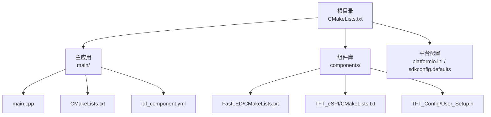
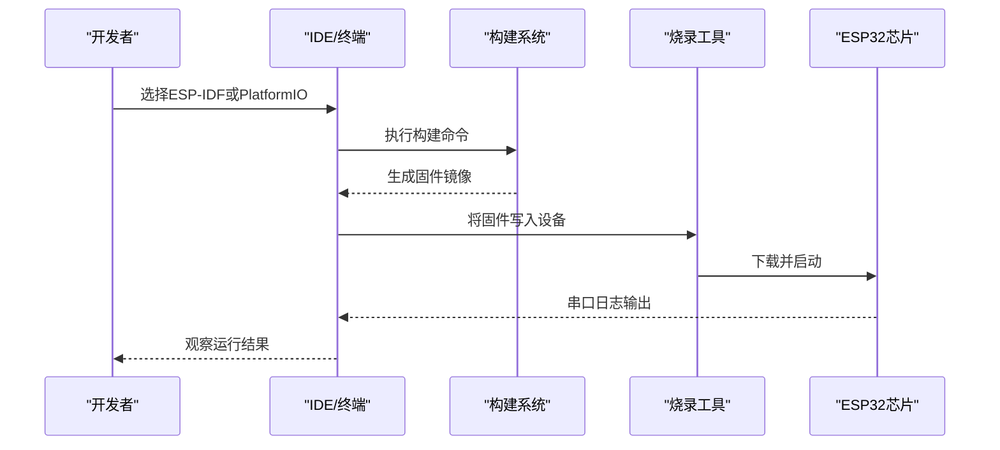
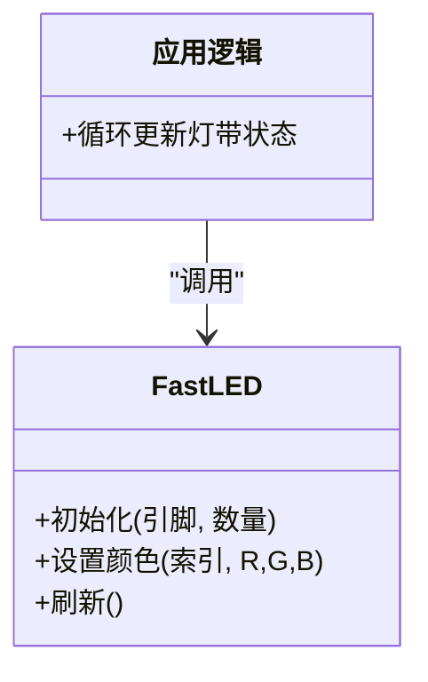
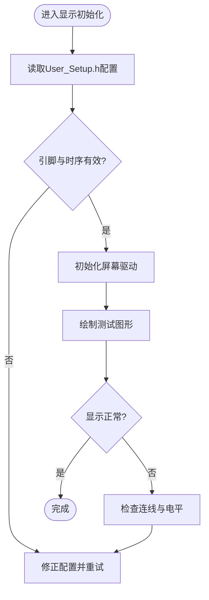
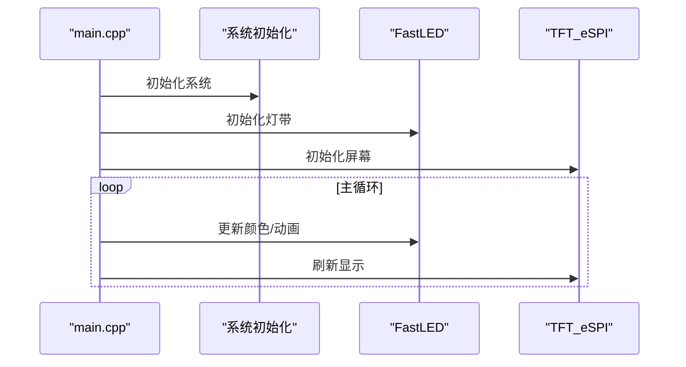
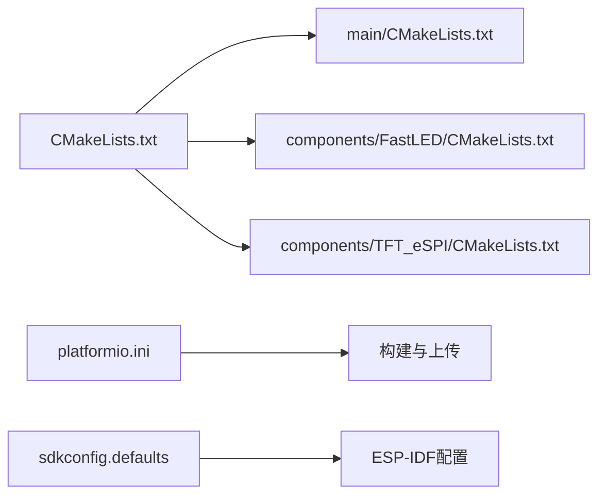

# 快速开始

<cite>
**本文引用的文件**   
- [CMakeLists.txt](file://CMakeLists.txt)
- [platformio.ini](file://platformio.ini)
- [sdkconfig.defaults](file://sdkconfig.defaults)
- [main/CMakeLists.txt](file://main/CMakeLists.txt)
- [main/idf_component.yml](file://main/idf_component.yml)
- [main/main.cpp](file://main/main.cpp)
- [src/main.cpp](file://src/main.cpp)
- [components/FastLED/CMakeLists.txt](file://components/FastLED/CMakeLists.txt)
- [components/TFT_Config/User_Setup.h](file://components/TFT_Config/User_Setup.h)
- [components/TFT_eSPI/CMakeLists.txt](file://components/TFT_eSPI/CMakeLists.txt)
</cite>

## 目录
1. [简介](#简介)
2. [项目结构](#项目结构)
3. [核心组件](#核心组件)
4. [架构总览](#架构总览)
5. [详细组件分析](#详细组件分析)
6. [依赖分析](#依赖分析)
7. [性能考虑](#性能考虑)
8. [故障排查指南](#故障排查指南)
9. [结论](#结论)
10. [附录](#附录)

## 简介
本指南面向首次接触ESP32中心节点项目的开发者，目标是帮助你在最短时间内完成环境搭建、硬件准备、编译烧录与运行验证。你将学会：
- 使用ESP-IDF或PlatformIO两种主流方式配置开发环境
- 准备ESP32开发板及显示模块、LED灯带等外设
- 编译、烧录并运行第一个程序
- 解决常见环境问题并完成安装验证

## 项目结构
本项目采用ESP-IDF工程组织方式，顶层包含构建脚本与平台配置文件，应用代码位于main目录，第三方组件以components形式集成，同时提供PlatformIO兼容配置以便在VS Code中快速上手。

图表来源
- [CMakeLists.txt](file://CMakeLists.txt)
- [main/CMakeLists.txt](file://main/CMakeLists.txt)
- [main/idf_component.yml](file://main/idf_component.yml)
- [components/FastLED/CMakeLists.txt](file://components/FastLED/CMakeLists.txt)
- [components/TFT_eSPI/CMakeLists.txt](file://components/TFT_eSPI/CMakeLists.txt)
- [components/TFT_Config/User_Setup.h](file://components/TFT_Config/User_Setup.h)

章节来源
- [CMakeLists.txt](file://CMakeLists.txt)
- [platformio.ini](file://platformio.ini)
- [sdkconfig.defaults](file://sdkconfig.defaults)
- [main/CMakeLists.txt](file://main/CMakeLists.txt)
- [main/idf_component.yml](file://main/idf_component.yml)
- [main/main.cpp](file://main/main.cpp)
- [src/main.cpp](file://src/main.cpp)
- [components/FastLED/CMakeLists.txt](file://components/FastLED/CMakeLists.txt)
- [components/TFT_Config/User_Setup.h](file://components/TFT_Config/User_Setup.h)
- [components/TFT_eSPI/CMakeLists.txt](file://components/TFT_eSPI/CMakeLists.txt)

## 核心组件
- 主应用入口
  - ESP-IDF路径：main/main.cpp
  - PlatformIO路径：src/main.cpp（用于PIO构建）
- 组件集成
  - FastLED：LED灯带驱动，通过components/FastLED/CMakeLists.txt纳入构建
  - TFT_eSPI：屏幕驱动，通过components/TFT_eSPI/CMakeLists.txt纳入构建
  - TFT_Config：屏幕引脚与初始化参数，位于components/TFT_Config/User_Setup.h
- 构建与配置
  - 顶层CMakeLists.txt：定义ESP-IDF工程与组件路径
  - main/CMakeLists.txt：声明主目标与依赖
  - main/idf_component.yml：ESP-IDF组件管理器清单
  - platformio.ini：PlatformIO工程配置
  - sdkconfig.defaults：ESP-IDF默认配置项

章节来源
- [main/main.cpp](file://main/main.cpp)
- [src/main.cpp](file://src/main.cpp)
- [components/FastLED/CMakeLists.txt](file://components/FastLED/CMakeLists.txt)
- [components/TFT_eSPI/CMakeLists.txt](file://components/TFT_eSPI/CMakeLists.txt)
- [components/TFT_Config/User_Setup.h](file://components/TFT_Config/User_Setup.h)
- [main/CMakeLists.txt](file://main/CMakeLists.txt)
- [main/idf_component.yml](file://main/idf_component.yml)
- [CMakeLists.txt](file://CMakeLists.txt)
- [platformio.ini](file://platformio.ini)
- [sdkconfig.defaults](file://sdkconfig.defaults)

## 架构总览
下图展示了从用户操作到设备运行的整体流程，包括环境选择、构建、烧录与串口输出。

图表来源
- [CMakeLists.txt](file://CMakeLists.txt)
- [platformio.ini](file://platformio.ini)
- [main/CMakeLists.txt](file://main/CMakeLists.txt)

## 详细组件分析

### 组件A：FastLED（LED灯带）
- 作用：提供WS2812B等可编程LED灯带的驱动能力
- 集成方式：通过components/FastLED/CMakeLists.txt加入工程
- 关键要点：
  - 确认数据引脚与供电满足要求
  - 避免与高频中断冲突，必要时调整优先级
  - 根据灯带长度合理分配内存

图表来源
- [components/FastLED/CMakeLists.txt](file://components/FastLED/CMakeLists.txt)

章节来源
- [components/FastLED/CMakeLists.txt](file://components/FastLED/CMakeLists.txt)

### 组件B：TFT_eSPI（屏幕显示）
- 作用：驱动TFT/LCD屏幕，支持多种控制器与接口
- 集成方式：通过components/TFT_eSPI/CMakeLists.txt加入工程
- 配置位置：components/TFT_Config/User_Setup.h中设置引脚、分辨率、控制器类型等
- 关键要点：
  - 正确配置SPI/并行接口引脚与时序
  - 根据屏幕型号启用对应驱动宏
  - 注意电源与信号线走线质量

图表来源
- [components/TFT_eSPI/CMakeLists.txt](file://components/TFT_eSPI/CMakeLists.txt)
- [components/TFT_Config/User_Setup.h](file://components/TFT_Config/User_Setup.h)

章节来源
- [components/TFT_eSPI/CMakeLists.txt](file://components/TFT_eSPI/CMakeLists.txt)
- [components/TFT_Config/User_Setup.h](file://components/TFT_Config/User_Setup.h)

### 组件C：主应用入口
- ESP-IDF入口：main/main.cpp
- PlatformIO入口：src/main.cpp
- 职责：初始化系统、外设与业务逻辑，进入主循环
- 建议：
  - 先打印基础信息验证串口
  - 逐步点亮LED与显示内容，定位问题范围

图表来源
- [main/main.cpp](file://main/main.cpp)
- [src/main.cpp](file://src/main.cpp)
- [components/FastLED/CMakeLists.txt](file://components/FastLED/CMakeLists.txt)
- [components/TFT_eSPI/CMakeLists.txt](file://components/TFT_eSPI/CMakeLists.txt)

章节来源
- [main/main.cpp](file://main/main.cpp)
- [src/main.cpp](file://src/main.cpp)

## 依赖分析
- 构建依赖
  - ESP-IDF框架：提供编译器、链接器与运行时库
  - components：FastLED与TFT_eSPI作为本地组件被引入
  - idf_component.yml：声明组件版本与来源（如需要联网获取）
- 平台配置
  - platformio.ini：指定工具链、板卡、端口与上传方法
  - sdkconfig.defaults：为ESP-IDF提供默认配置项

图表来源
- [CMakeLists.txt](file://CMakeLists.txt)
- [main/CMakeLists.txt](file://main/CMakeLists.txt)
- [components/FastLED/CMakeLists.txt](file://components/FastLED/CMakeLists.txt)
- [components/TFT_eSPI/CMakeLists.txt](file://components/TFT_eSPI/CMakeLists.txt)
- [platformio.ini](file://platformio.ini)
- [sdkconfig.defaults](file://sdkconfig.defaults)

章节来源
- [CMakeLists.txt](file://CMakeLists.txt)
- [main/CMakeLists.txt](file://main/CMakeLists.txt)
- [main/idf_component.yml](file://main/idf_component.yml)
- [platformio.ini](file://platformio.ini)
- [sdkconfig.defaults](file://sdkconfig.defaults)

## 性能考虑
- LED灯带
  - 控制频率与DMA：优先使用DMA以降低CPU占用
  - 内存分配：按灯珠数量预估缓冲区大小，避免频繁动态分配
- 屏幕显示
  - 刷新策略：局部刷新优于全屏刷新
  - 色彩深度与压缩：根据需求权衡清晰度与带宽
- 系统资源
  - 任务优先级：显示与灯带更新尽量低优先级，避免抢占关键任务
  - 功耗管理：空闲时降低刷新率与亮度

[本节为通用指导，不直接分析具体文件]

## 故障排查指南
- 无法识别USB串口
  - 检查数据线是否为充电线而非数据线
  - 确认设备管理器中端口号，并在IDE中正确设置
- 编译失败（找不到组件）
  - 确认components目录结构与CMakeLists引用一致
  - 若使用idf_component.yml，确保网络可达或已缓存组件
- 屏幕无显示
  - 核对User_Setup.h中的引脚、控制器与时序
  - 检查供电与信号线连接，必要时测量电平
- LED不亮或闪烁异常
  - 确认数据引脚与供电电流足够
  - 避免与高优先级中断冲突，调整任务优先级
- 烧录后重启循环
  - 查看串口日志定位崩溃点
  - 减小功能复杂度，分步验证各外设

章节来源
- [platformio.ini](file://platformio.ini)
- [sdkconfig.defaults](file://sdkconfig.defaults)
- [components/TFT_Config/User_Setup.h](file://components/TFT_Config/User_Setup.h)

## 结论
通过本指南，你应已完成ESP32中心节点的环境搭建、硬件准备与首个程序的编译烧录。建议后续逐步扩展功能，结合串口日志与分步验证法定位问题，提升稳定性与可维护性。

[本节为总结性内容，不直接分析具体文件]

## 附录

### 一、开发环境搭建（二选一）

#### 方案A：ESP-IDF（推荐）
- 安装ESP-IDF
  - 使用官方安装器或Git克隆至本地
  - 配置环境变量与工具链
- 打开项目
  - 在终端进入工程根目录
- 配置默认选项
  - 参考sdkconfig.defaults进行必要修改
- 构建与烧录
  - 使用idf.py build与idf.py -p PORT flash
- 监视串口
  - 使用idf.py monitor

章节来源
- [CMakeLists.txt](file://CMakeLists.txt)
- [sdkconfig.defaults](file://sdkconfig.defaults)
- [main/CMakeLists.txt](file://main/CMakeLists.txt)

#### 方案B：PlatformIO（VS Code）
- 安装VS Code与PlatformIO插件
- 打开工程根目录
- 选择目标板与端口
- 构建与上传
  - 点击“上传”按钮或使用命令行pio run -t upload
- 监视串口
  - 点击“监视器”

章节来源
- [platformio.ini](file://platformio.ini)
- [src/main.cpp](file://src/main.cpp)

### 二、硬件准备清单
- ESP32开发板（如ESP32-DevKitC或兼容板）
- USB数据线（支持数据传输）
- 显示模块（TFT/LCD，需与User_Setup.h匹配）
- LED灯带（WS2812B等，注意供电与限流）
- 面包板与杜邦线（便于接线）
- 可选：外部电源（保证灯带与屏幕稳定供电）

[本节为通用清单，不直接分析具体文件]

### 三、第一个程序：编译、烧录与运行
- 步骤
  - 连接开发板到电脑
  - 选择正确的COM端口
  - 构建工程
  - 烧录固件
  - 打开串口监视器，观察输出
- 预期现象
  - 串口打印初始化信息
  - LED灯带出现预设效果
  - 屏幕显示初始画面或测试图案

章节来源
- [main/main.cpp](file://main/main.cpp)
- [src/main.cpp](file://src/main.cpp)
- [components/TFT_Config/User_Setup.h](file://components/TFT_Config/User_Setup.h)

### 四、常见问题与解决方案
- 端口权限问题（Linux/macOS）
  - 将用户加入dialout组或授予串口访问权限
- 组件未找到
  - 检查components目录与CMakeLists引用
  - 若使用idf_component.yml，确认网络或离线缓存
- 屏幕乱码或不显示
  - 重新核对User_Setup.h的引脚与控制器配置
- LED抖动或掉帧
  - 降低刷新频率或减少每帧更新量
  - 优化任务调度与中断优先级

章节来源
- [platformio.ini](file://platformio.ini)
- [sdkconfig.defaults](file://sdkconfig.defaults)
- [components/TFT_Config/User_Setup.h](file://components/TFT_Config/User_Setup.h)

### 五、安装验证测试
- 串口回显
  - 发送字符，确认收到相同内容
- LED测试
  - 观察是否按预设顺序变色或呼吸效果
- 屏幕测试
  - 显示纯色块或简单几何图形，确认无花屏

章节来源
- [main/main.cpp](file://main/main.cpp)
- [src/main.cpp](file://src/main.cpp)
- [components/TFT_Config/User_Setup.h](file://components/TFT_Config/User_Setup.h)