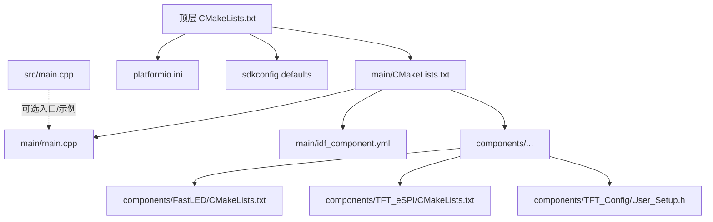
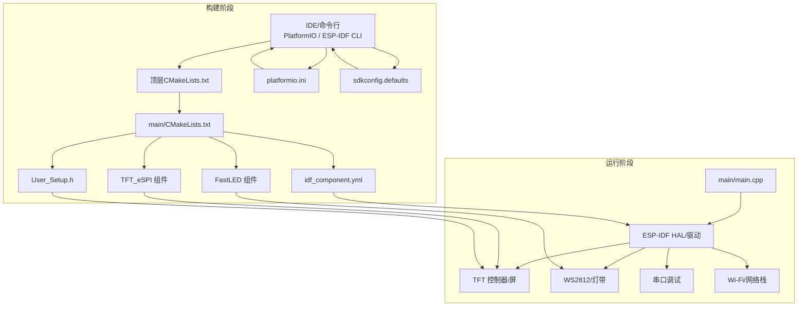
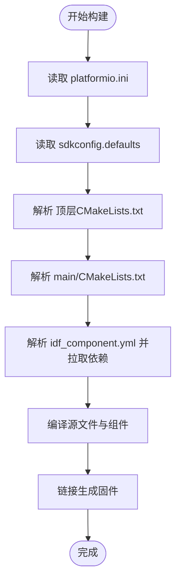
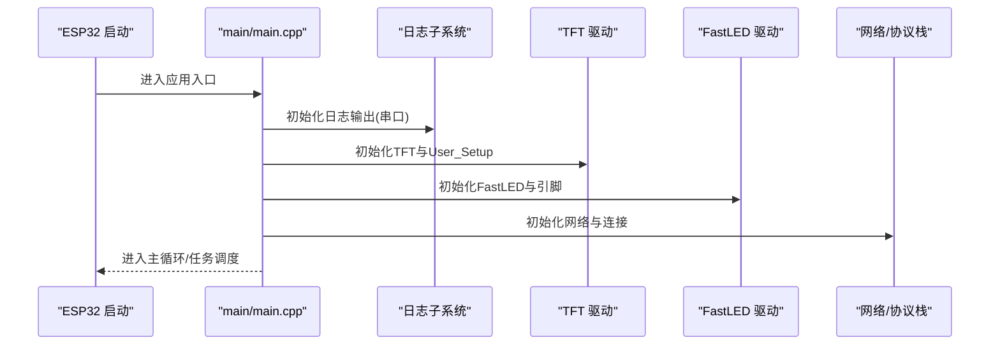
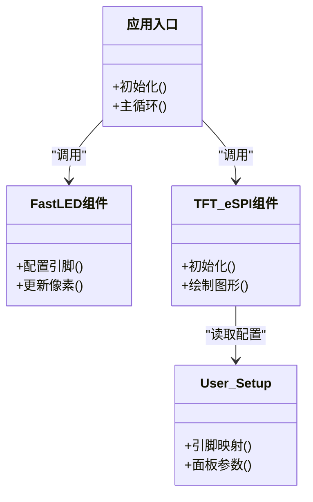
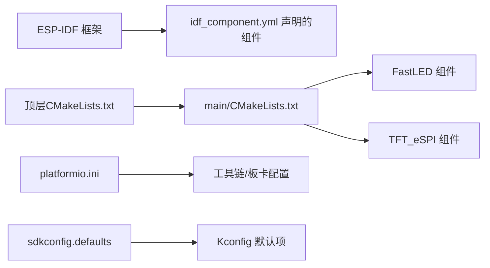

# 故障排除

<cite>
**本文引用的文件**   
- [CMakeLists.txt](file://CMakeLists.txt)
- [platformio.ini](file://platformio.ini)
- [sdkconfig.defaults](file://sdkconfig.defaults)
- [main/CMakeLists.txt](file://main/CMakeLists.txt)
- [main/idf_component.yml](file://main/idf_component.yml)
- [main/main.cpp](file://main/main.cpp)
- [src/main.cpp](file://src/main.cpp)
- [components/FastLED/CMakeLists.txt](file://components/FastLED/CMakeLists.txt)
- [components/TFT_Config/User_Setup.h](file://components/TFT_Config/User_Setup.h)
- [components/TFT_eSPI/CMakeLists.txt](file://components/TFT_eSPI/CMakeLists.txt)
</cite>

## 目录
1. [简介](#简介)
2. [项目结构](#项目结构)
3. [核心组件](#核心组件)
4. [架构总览](#架构总览)
5. [详细组件分析](#详细组件分析)
6. [依赖关系分析](#依赖关系分析)
7. [性能考虑](#性能考虑)
8. [故障排除指南](#故障排除指南)
9. [结论](#结论)
10. [附录](#附录)

## 简介
本指南面向ESP32中心节点项目的开发与维护人员，聚焦于“常见问题排查与解决方案”。内容覆盖：
- 开发环境搭建的典型错误与修复方法
- 编译构建阶段的常见错误（依赖缺失、路径配置等）
- 运行时硬件相关问题诊断（TFT显示异常、LED灯带不工作等）
- 调试技巧与日志分析方法
- 性能瓶颈识别与优化建议
- 问题分类索引，便于快速定位解决方案

## 项目结构
本项目采用分层组织方式：顶层为工程级构建与平台配置；main为应用入口与组件清单；components包含第三方库与用户配置；src提供可替换的源文件。

图示来源
- [CMakeLists.txt:1-200](file://CMakeLists.txt#L1-L200)
- [main/CMakeLists.txt:1-200](file://main/CMakeLists.txt#L1-L200)
- [platformio.ini:1-200](file://platformio.ini#L1-L200)
- [sdkconfig.defaults:1-200](file://sdkconfig.defaults#L1-L200)
- [main/main.cpp:1-200](file://main/main.cpp#L1-L200)
- [src/main.cpp:1-200](file://src/main.cpp#L1-L200)
- [components/FastLED/CMakeLists.txt:1-200](file://components/FastLED/CMakeLists.txt#L1-L200)
- [components/TFT_eSPI/CMakeLists.txt:1-200](file://components/TFT_eSPI/CMakeLists.txt#L1-L200)
- [components/TFT_Config/User_Setup.h:1-200](file://components/TFT_Config/User_Setup.h#L1-L200)

章节来源
- [CMakeLists.txt:1-200](file://CMakeLists.txt#L1-L200)
- [main/CMakeLists.txt:1-200](file://main/CMakeLists.txt#L1-L200)
- [platformio.ini:1-200](file://platformio.ini#L1-L200)
- [sdkconfig.defaults:1-200](file://sdkconfig.defaults#L1-L200)
- [main/main.cpp:1-200](file://main/main.cpp#L1-L200)
- [src/main.cpp:1-200](file://src/main.cpp#L1-L200)
- [components/FastLED/CMakeLists.txt:1-200](file://components/FastLED/CMakeLists.txt#L1-L200)
- [components/TFT_eSPI/CMakeLists.txt:1-200](file://components/TFT_eSPI/CMakeLists.txt#L1-L200)
- [components/TFT_Config/User_Setup.h:1-200](file://components/TFT_Config/User_Setup.h#L1-L200)

## 核心组件
- 应用入口与初始化流程：位于 main/main.cpp，负责系统初始化、外设驱动加载、业务逻辑启动。
- 组件清单与依赖声明：位于 main/idf_component.yml，用于声明ESP-IDF组件依赖及版本约束。
- 构建脚本：顶层与main下的CMakeLists.txt定义目标、源文件集合、包含路径与链接选项。
- 平台配置：platformio.ini指定工具链、板卡、框架与全局编译选项；sdkconfig.defaults提供默认Kconfig选项。
- 第三方库与用户配置：
  - FastLED：LED灯带控制库，其CMakeLists.txt需正确注册到工程中。
  - TFT_eSPI：TFT屏幕驱动库，配合User_Setup.h进行引脚与面板参数配置。

章节来源
- [main/main.cpp:1-200](file://main/main.cpp#L1-L200)
- [main/idf_component.yml:1-200](file://main/idf_component.yml#L1-L200)
- [CMakeLists.txt:1-200](file://CMakeLists.txt#L1-L200)
- [main/CMakeLists.txt:1-200](file://main/CMakeLists.txt#L1-L200)
- [platformio.ini:1-200](file://platformio.ini#L1-L200)
- [sdkconfig.defaults:1-200](file://sdkconfig.defaults#L1-L200)
- [components/FastLED/CMakeLists.txt:1-200](file://components/FastLED/CMakeLists.txt#L1-L200)
- [components/TFT_eSPI/CMakeLists.txt:1-200](file://components/TFT_eSPI/CMakeLists.txt#L1-L200)
- [components/TFT_Config/User_Setup.h:1-200](file://components/TFT_Config/User_Setup.h#L1-L200)

## 架构总览
下图展示从构建到运行的关键路径与交互关系，包括IDE/CLI、构建系统、ESP-IDF组件系统与硬件外设。

图示来源
- [CMakeLists.txt:1-200](file://CMakeLists.txt#L1-L200)
- [main/CMakeLists.txt:1-200](file://main/CMakeLists.txt#L1-L200)
- [main/idf_component.yml:1-200](file://main/idf_component.yml#L1-L200)
- [platformio.ini:1-200](file://platformio.ini#L1-L200)
- [sdkconfig.defaults:1-200](file://sdkconfig.defaults#L1-L200)
- [components/FastLED/CMakeLists.txt:1-200](file://components/FastLED/CMakeLists.txt#L1-L200)
- [components/TFT_eSPI/CMakeLists.txt:1-200](file://components/TFT_eSPI/CMakeLists.txt#L1-L200)
- [components/TFT_Config/User_Setup.h:1-200](file://components/TFT_Config/User_Setup.h#L1-L200)
- [main/main.cpp:1-200](file://main/main.cpp#L1-L200)

## 详细组件分析

### 构建与配置子系统
- 顶层CMakeLists.txt：定义工程目标、包含子目录、统一编译选项。
- main/CMakeLists.txt：声明应用源文件、链接组件、设置包含路径。
- platformio.ini：指定工具链、目标板、框架版本、全局宏与库搜索路径。
- sdkconfig.defaults：提供默认Kconfig项，避免每次手动配置。

图示来源
- [platformio.ini:1-200](file://platformio.ini#L1-L200)
- [sdkconfig.defaults:1-200](file://sdkconfig.defaults#L1-L200)
- [CMakeLists.txt:1-200](file://CMakeLists.txt#L1-L200)
- [main/CMakeLists.txt:1-200](file://main/CMakeLists.txt#L1-L200)
- [main/idf_component.yml:1-200](file://main/idf_component.yml#L1-L200)

章节来源
- [CMakeLists.txt:1-200](file://CMakeLists.txt#L1-L200)
- [main/CMakeLists.txt:1-200](file://main/CMakeLists.txt#L1-L200)
- [platformio.ini:1-200](file://platformio.ini#L1-L200)
- [sdkconfig.defaults:1-200](file://sdkconfig.defaults#L1-L200)
- [main/idf_component.yml:1-200](file://main/idf_component.yml#L1-L200)

### 应用入口与初始化流程
- main/main.cpp：系统启动后执行初始化序列，依次完成日志、外设、网络与业务模块初始化。
- src/main.cpp：可作为替代入口或示例实现，注意与main/main.cpp的互斥使用。

图示来源
- [main/main.cpp:1-200](file://main/main.cpp#L1-L200)
- [components/TFT_Config/User_Setup.h:1-200](file://components/TFT_Config/User_Setup.h#L1-L200)
- [components/FastLED/CMakeLists.txt:1-200](file://components/FastLED/CMakeLists.txt#L1-L200)

章节来源
- [main/main.cpp:1-200](file://main/main.cpp#L1-L200)
- [src/main.cpp:1-200](file://src/main.cpp#L1-L200)

### 第三方库集成要点
- FastLED：确保组件CMakeLists.txt被包含，且引脚与数据格式与硬件一致。
- TFT_eSPI：通过User_Setup.h配置引脚、时序与面板参数，保证与屏幕型号匹配。

图示来源
- [components/FastLED/CMakeLists.txt:1-200](file://components/FastLED/CMakeLists.txt#L1-L200)
- [components/TFT_eSPI/CMakeLists.txt:1-200](file://components/TFT_eSPI/CMakeLists.txt#L1-L200)
- [components/TFT_Config/User_Setup.h:1-200](file://components/TFT_Config/User_Setup.h#L1-L200)
- [main/main.cpp:1-200](file://main/main.cpp#L1-L200)

章节来源
- [components/FastLED/CMakeLists.txt:1-200](file://components/FastLED/CMakeLists.txt#L1-L200)
- [components/TFT_eSPI/CMakeLists.txt:1-200](file://components/TFT_eSPI/CMakeLists.txt#L1-L200)
- [components/TFT_Config/User_Setup.h:1-200](file://components/TFT_Config/User_Setup.h#L1-L200)
- [main/main.cpp:1-200](file://main/main.cpp#L1-L200)

## 依赖关系分析
- 组件依赖由idf_component.yml声明，构建时自动解析与下载。
- CMakeLists.txt将第三方组件纳入编译树，确保include路径与链接正确。
- platformio.ini与sdkconfig.defaults影响工具链、板型与内核配置。

图示来源
- [main/idf_component.yml:1-200](file://main/idf_component.yml#L1-L200)
- [CMakeLists.txt:1-200](file://CMakeLists.txt#L1-L200)
- [main/CMakeLists.txt:1-200](file://main/CMakeLists.txt#L1-L200)
- [platformio.ini:1-200](file://platformio.ini#L1-L200)
- [sdkconfig.defaults:1-200](file://sdkconfig.defaults#L1-L200)

章节来源
- [main/idf_component.yml:1-200](file://main/idf_component.yml#L1-L200)
- [CMakeLists.txt:1-200](file://CMakeLists.txt#L1-L200)
- [main/CMakeLists.txt:1-200](file://main/CMakeLists.txt#L1-L200)
- [platformio.ini:1-200](file://platformio.ini#L1-L200)
- [sdkconfig.defaults:1-200](file://sdkconfig.defaults#L1-L200)

## 性能考虑
- 内存与堆栈：合理分配缓冲区，避免大对象在栈上创建；必要时启用动态内存监控。
- 外设带宽：TFT刷新与LED更新在高帧率下可能占用大量总线带宽，建议降低刷新频率或批量更新。
- 中断与任务：将耗时操作放入后台任务，避免阻塞主循环；合理使用优先级与队列。
- 功耗与发热：高亮度LED与高频刷新会增加功耗与发热，需评估供电能力与散热条件。

[本节为通用指导，无需特定文件引用]

## 故障排除指南

### 一、开发环境搭建类问题
- 现象
  - PlatformIO无法识别ESP32目标或找不到工具链
  - ESP-IDF命令不可用或版本不匹配
- 排查步骤
  - 检查platformio.ini中的目标板与框架版本是否与已安装工具链一致
  - 确认环境变量与PATH指向正确的ESP-IDF与Python环境
  - 清理缓存并重新初始化平台
- 常见原因
  - 多版本Python/ESP-IDF共存导致冲突
  - 代理或镜像未配置导致依赖下载失败
- 解决建议
  - 固定工具链与框架版本，避免频繁切换
  - 配置国内镜像加速依赖下载
  - 使用独立虚拟环境隔离不同项目依赖

章节来源
- [platformio.ini:1-200](file://platformio.ini#L1-L200)

### 二、编译构建类问题
- 现象
  - 找不到头文件或组件
  - 链接失败，符号未定义
  - 包含路径不正确
- 排查步骤
  - 核对main/CMakeLists.txt是否包含必要的源文件与组件
  - 检查idf_component.yml是否正确声明依赖
  - 验证顶层CMakeLists.txt是否包含main子目录
- 常见原因
  - 第三方组件未正确注册或未拉取
  - include路径未添加到编译选项
  - 组件版本与ESP-IDF不兼容
- 解决建议
  - 使用idf_component_manager拉取并锁定依赖版本
  - 在CMakeLists中显式添加include路径与链接库
  - 升级或降级相关组件以匹配当前ESP-IDF版本

章节来源
- [CMakeLists.txt:1-200](file://CMakeLists.txt#L1-L200)
- [main/CMakeLists.txt:1-200](file://main/CMakeLists.txt#L1-L200)
- [main/idf_component.yml:1-200](file://main/idf_component.yml#L1-L200)

### 三、运行时硬件类问题
- TFT显示异常
  - 现象：黑屏、花屏、触摸无响应
  - 排查：
    - 检查User_Setup.h中的引脚映射与面板参数是否与硬件一致
    - 确认TFT供电稳定，复位与选择线电平正常
    - 降低刷新率或分辨率测试是否为带宽不足
  - 解决：修正User_Setup配置，增加延时或调整时序参数
- LED灯带不工作
  - 现象：全灭、颜色错乱、闪烁
  - 排查：
    - 确认FastLED数据引脚与电源供给
    - 检查像素数量与数据类型配置
    - 减少同时更新的像素数，观察是否因电流不足导致重启
  - 解决：增加外部供电，限制最大亮度与刷新速率，校准引脚与类型

章节来源
- [components/TFT_Config/User_Setup.h:1-200](file://components/TFT_Config/User_Setup.h#L1-L200)
- [components/FastLED/CMakeLists.txt:1-200](file://components/FastLED/CMakeLists.txt#L1-L200)
- [main/main.cpp:1-200](file://main/main.cpp#L1-L200)

### 四、调试技巧与日志分析
- 启用串口日志
  - 在应用入口初始化日志输出，设置合适的波特率
  - 使用分级日志（信息、警告、错误）区分重要程度
- 断点与单步
  - 在IDE中设置断点，逐步跟踪初始化流程
  - 关注外设初始化返回值，尽早发现错误
- 资源监控
  - 打印堆栈剩余与任务状态，定位内存泄漏或栈溢出
  - 记录关键路径耗时，识别性能热点
- 日志分析方法
  - 过滤关键字段（如初始化阶段、外设名称）
  - 按时间戳排序，重建事件序列
  - 对比正常与异常日志差异，定位变更点

章节来源
- [main/main.cpp:1-200](file://main/main.cpp#L1-L200)

### 五、性能瓶颈识别与优化建议
- 识别方法
  - 使用计时函数测量关键路径耗时
  - 观察CPU占用与中断延迟，判断是否被阻塞
- 优化策略
  - 批处理与增量更新：减少重复计算与传输
  - 异步化：将I/O与渲染放入任务队列
  - 资源复用：重用缓冲区与对象，避免频繁分配
  - 降低负载：适当降低刷新率、分辨率或LED亮度

[本节为通用指导，无需特定文件引用]

### 六、问题分类索引
- 环境搭建
  - 工具链/框架版本不匹配
  - 依赖下载失败
- 构建阶段
  - 头文件/组件缺失
  - 链接失败
  - 包含路径错误
- 运行阶段
  - TFT显示异常
  - LED灯带不工作
  - Wi-Fi连接失败
- 调试与日志
  - 日志级别与输出目标
  - 断点与单步调试
  - 资源监控与性能分析
- 性能优化
  - 内存与堆栈
  - 外设带宽与刷新率
  - 任务调度与中断

[本节为索引说明，无需特定文件引用]

### 七、社区疑难问题汇总
- 多组件版本冲突
  - 症状：编译成功但运行崩溃
  - 建议：锁定所有组件版本，避免隐式升级
- 电源不足导致的间歇性重启
  - 症状：高负载时重启
  - 建议：增加外部供电与去耦电容，限制峰值负载
- 屏幕与MCU引脚复用冲突
  - 症状：部分功能失效
  - 建议：核对引脚复用表，避免冲突

[本节为经验总结，无需特定文件引用]

## 结论
通过系统化梳理环境搭建、构建配置、硬件驱动与调试方法，能够快速定位并解决ESP32中心节点项目的常见问题。建议在项目中固化最佳实践：固定依赖版本、完善日志与监控、严格校验硬件配置，并在迭代过程中持续收集与沉淀疑难问题解答。

[本节为总结，无需特定文件引用]

## 附录
- 常用命令与路径
  - 清理构建缓存：删除构建目录后重新构建
  - 查看组件依赖：列出已安装的组件及其版本
  - 导出配置：导出当前Kconfig配置以便复现
- 参考文件
  - 构建与配置：顶层CMakeLists.txt、main/CMakeLists.txt、platformio.ini、sdkconfig.defaults
  - 组件与配置：idf_component.yml、FastLED/CMakeLists.txt、TFT_eSPI/CMakeLists.txt、User_Setup.h
  - 应用入口：main/main.cpp、src/main.cpp

章节来源
- [CMakeLists.txt:1-200](file://CMakeLists.txt#L1-L200)
- [main/CMakeLists.txt:1-200](file://main/CMakeLists.txt#L1-L200)
- [platformio.ini:1-200](file://platformio.ini#L1-L200)
- [sdkconfig.defaults:1-200](file://sdkconfig.defaults#L1-L200)
- [main/idf_component.yml:1-200](file://main/idf_component.yml#L1-L200)
- [components/FastLED/CMakeLists.txt:1-200](file://components/FastLED/CMakeLists.txt#L1-L200)
- [components/TFT_eSPI/CMakeLists.txt:1-200](file://components/TFT_eSPI/CMakeLists.txt#L1-L200)
- [components/TFT_Config/User_Setup.h:1-200](file://components/TFT_Config/User_Setup.h#L1-L200)
- [main/main.cpp:1-200](file://main/main.cpp#L1-L200)
- [src/main.cpp:1-200](file://src/main.cpp#L1-L200)