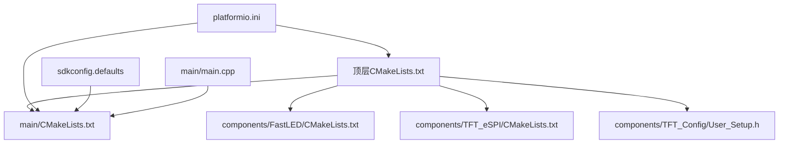
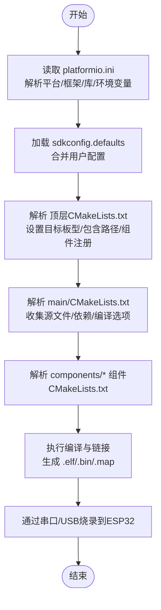
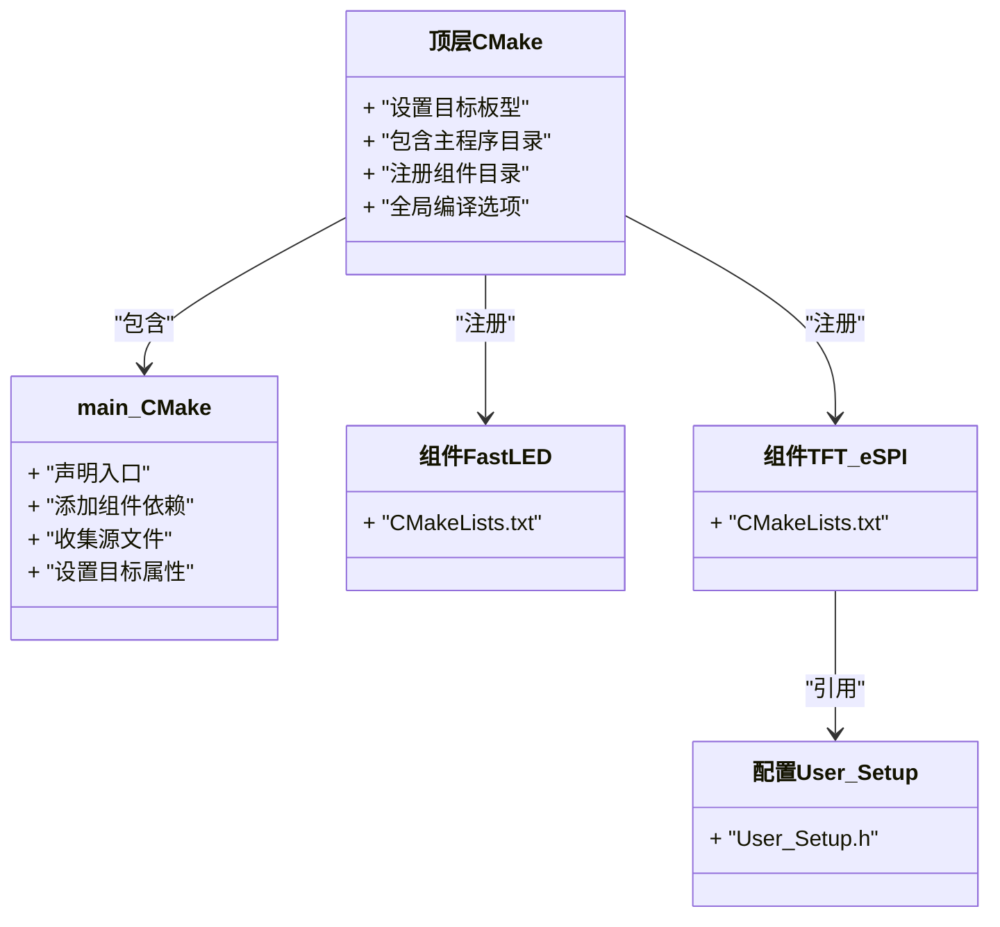
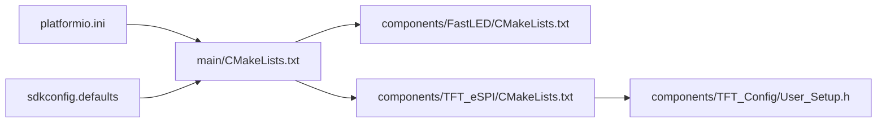
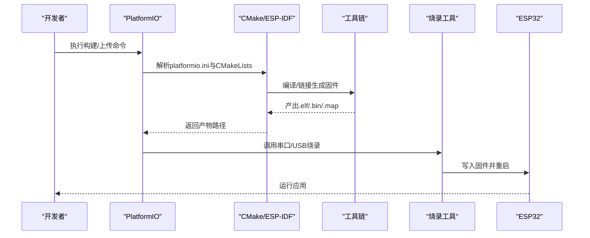

# 构建与部署

<cite>
**本文引用的文件**   
- [CMakeLists.txt](file://CMakeLists.txt)
- [main/CMakeLists.txt](file://main/CMakeLists.txt)
- [platformio.ini](file://platformio.ini)
- [sdkconfig.defaults](file://sdkconfig.defaults)
- [components/FastLED/CMakeLists.txt](file://components/FastLED/CMakeLists.txt)
- [components/TFT_eSPI/CMakeLists.txt](file://components/TFT_eSPI/CMakeLists.txt)
- [components/TFT_Config/User_Setup.h](file://components/TFT_Config/User_Setup.h)
- [main/main.cpp](file://main/main.cpp)
</cite>

## 目录
1. [简介](#简介)
2. [项目结构](#项目结构)
3. [核心组件](#核心组件)
4. [架构总览](#架构总览)
5. [详细组件分析](#详细组件分析)
6. [依赖分析](#依赖分析)
7. [性能考虑](#性能考虑)
8. [故障排查指南](#故障排查指南)
9. [结论](#结论)
10. [附录](#附录)

## 简介
本文件面向ESP32中心节点的构建与部署，重点说明：
- CMake构建系统的配置与使用（顶层与main子目录）
- PlatformIO命令行工具常用命令与脚本编写方法
- 固件编译、链接与生成过程
- ESP32芯片的固件烧录步骤（串口连接、波特率设置、烧录工具）
- 不同开发环境下的构建命令示例
- 构建优化选项与调试信息生成方法
- 常见构建错误与部署问题的解决思路

## 项目结构
本项目采用ESP-IDF风格的组件化组织方式，结合PlatformIO进行工程管理与构建。关键目录与文件职责如下：
- 顶层CMakeLists.txt：定义目标板型、包含主程序目录、注册组件等
- main/CMakeLists.txt：声明主程序入口、组件依赖、源文件集合等
- components/：第三方或自定义组件（FastLED、TFT_eSPI、TFT_Config），各自提供CMakeLists.txt以被系统发现
- platformio.ini：PlatformIO工程配置（平台、框架、库、环境变量等）
- sdkconfig.defaults：ESP-IDF默认配置项（如Wi-Fi、蓝牙、日志级别等）
- src/main.cpp与main/main.cpp：应用入口点（具体实现位置取决于构建配置）

图表来源
- [CMakeLists.txt:1-200](file://CMakeLists.txt#L1-L200)
- [main/CMakeLists.txt:1-200](file://main/CMakeLists.txt#L1-L200)
- [components/FastLED/CMakeLists.txt:1-200](file://components/FastLED/CMakeLists.txt#L1-L200)
- [components/TFT_eSPI/CMakeLists.txt:1-200](file://components/TFT_eSPI/CMakeLists.txt#L1-L200)
- [components/TFT_Config/User_Setup.h:1-200](file://components/TFT_Config/User_Setup.h#L1-L200)
- [platformio.ini:1-200](file://platformio.ini#L1-L200)
- [sdkconfig.defaults:1-200](file://sdkconfig.defaults#L1-L200)
- [main/main.cpp:1-200](file://main/main.cpp#L1-L200)

章节来源
- [CMakeLists.txt:1-200](file://CMakeLists.txt#L1-L200)
- [main/CMakeLists.txt:1-200](file://main/CMakeLists.txt#L1-L200)
- [platformio.ini:1-200](file://platformio.ini#L1-L200)
- [sdkconfig.defaults:1-200](file://sdkconfig.defaults#L1-L200)

## 核心组件
- 顶层CMakeLists.txt
  - 作用：指定目标芯片（如esp32）、包含主程序目录、注册components子目录、设置全局编译选项等
  - 关键点：确保include_directories、idf_component_register或target_*命令正确指向源码与头文件路径
- main/CMakeLists.txt
  - 作用：声明主程序入口、添加组件依赖、收集源文件、设置编译/链接选项
  - 关键点：component_add_dependencies、add_compile_options、set_target_properties等
- components/*
  - FastLED/CMakeLists.txt：将FastLED作为组件暴露给上层
  - TFT_eSPI/CMakeLists.txt：将TFT显示驱动作为组件暴露
  - TFT_Config/User_Setup.h：屏幕引脚、初始化参数等用户配置
- platformio.ini
  - 作用：定义平台（espressif32）、框架（espidf）、库依赖、环境变量、上传端口与速率等
- sdkconfig.defaults
  - 作用：为ESP-IDF提供默认配置项（如网络栈、日志、功耗等）

章节来源
- [CMakeLists.txt:1-200](file://CMakeLists.txt#L1-L200)
- [main/CMakeLists.txt:1-200](file://main/CMakeLists.txt#L1-L200)
- [components/FastLED/CMakeLists.txt:1-200](file://components/FastLED/CMakeLists.txt#L1-L200)
- [components/TFT_eSPI/CMakeLists.txt:1-200](file://components/TFT_eSPI/CMakeLists.txt#L1-L200)
- [components/TFT_Config/User_Setup.h:1-200](file://components/TFT_Config/User_Setup.h#L1-L200)
- [platformio.ini:1-200](file://platformio.ini#L1-L200)
- [sdkconfig.defaults:1-200](file://sdkconfig.defaults#L1-L200)

## 架构总览
下图展示了从工程配置到固件生成的整体流程，以及各配置文件之间的依赖关系。

图表来源
- [platformio.ini:1-200](file://platformio.ini#L1-L200)
- [sdkconfig.defaults:1-200](file://sdkconfig.defaults#L1-L200)
- [CMakeLists.txt:1-200](file://CMakeLists.txt#L1-L200)
- [main/CMakeLists.txt:1-200](file://main/CMakeLists.txt#L1-L200)
- [components/FastLED/CMakeLists.txt:1-200](file://components/FastLED/CMakeLists.txt#L1-L200)
- [components/TFT_eSPI/CMakeLists.txt:1-200](file://components/TFT_eSPI/CMakeLists.txt#L1-L200)

## 详细组件分析

### CMake构建系统（顶层与main）
- 顶层CMakeLists.txt
  - 负责：设置目标芯片、包含主程序目录、注册components、统一编译选项
  - 建议：避免在顶层硬编码绝对路径；使用相对路径与变量；仅做“装配”逻辑
- main/CMakeLists.txt
  - 负责：声明主程序入口、添加组件依赖、收集源文件、设置目标属性
  - 建议：将可移植的配置放入sdkconfig.defaults或通过环境变量注入

图表来源
- [CMakeLists.txt:1-200](file://CMakeLists.txt#L1-L200)
- [main/CMakeLists.txt:1-200](file://main/CMakeLists.txt#L1-L200)
- [components/FastLED/CMakeLists.txt:1-200](file://components/FastLED/CMakeLists.txt#L1-L200)
- [components/TFT_eSPI/CMakeLists.txt:1-200](file://components/TFT_eSPI/CMakeLists.txt#L1-L200)
- [components/TFT_Config/User_Setup.h:1-200](file://components/TFT_Config/User_Setup.h#L1-L200)

章节来源
- [CMakeLists.txt:1-200](file://CMakeLists.txt#L1-L200)
- [main/CMakeLists.txt:1-200](file://main/CMakeLists.txt#L1-L200)
- [components/FastLED/CMakeLists.txt:1-200](file://components/FastLED/CMakeLists.txt#L1-L200)
- [components/TFT_eSPI/CMakeLists.txt:1-200](file://components/TFT_eSPI/CMakeLists.txt#L1-L200)
- [components/TFT_Config/User_Setup.h:1-200](file://components/TFT_Config/User_Setup.h#L1-L200)

### PlatformIO工程配置
- platformio.ini
  - 作用：定义平台（espressif32）、框架（espidf）、库依赖、环境变量、上传端口与速率等
  - 建议：将端口与速率放在[env]中以便复用；通过build_flags注入CMake变量或编译器开关
- 常用命令
  - 构建：pio run
  - 清理：pio run --clean
  - 上传：pio run --target upload
  - 监视串口：pio device monitor
  - 查看构建输出：pio run -v
- 脚本编写
  - 使用extra_scripts_pre.py/extra_scripts_post.py在构建前后执行自定义逻辑（例如自动更新sdkconfig.defaults、生成版本信息等）

章节来源
- [platformio.ini:1-200](file://platformio.ini#L1-L200)

### SDK配置（sdkconfig.defaults）
- 作用：为ESP-IDF提供默认配置项（如网络、日志、功耗、外设等）
- 建议：按功能模块拆分配置项；在CI中根据目标设备选择不同defaults

章节来源
- [sdkconfig.defaults:1-200](file://sdkconfig.defaults#L1-L200)

### 应用入口与组件集成
- main/main.cpp
  - 作用：应用初始化与主循环（具体实现由业务决定）
- 组件集成
  - FastLED：用于LED控制
  - TFT_eSPI + User_Setup.h：用于屏幕驱动与引脚配置

章节来源
- [main/main.cpp:1-200](file://main/main.cpp#L1-L200)
- [components/FastLED/CMakeLists.txt:1-200](file://components/FastLED/CMakeLists.txt#L1-L200)
- [components/TFT_eSPI/CMakeLists.txt:1-200](file://components/TFT_eSPI/CMakeLists.txt#L1-L200)
- [components/TFT_Config/User_Setup.h:1-200](file://components/TFT_Config/User_Setup.h#L1-L200)

## 依赖分析
- 组件耦合
  - main依赖FastLED与TFT_eSPI两个组件
  - TFT_eSPI依赖User_Setup.h中的硬件配置
- 外部依赖
  - ESP-IDF框架与工具链（由PlatformIO管理）
  - 串口通信工具（用于烧录与监视）

图表来源
- [main/CMakeLists.txt:1-200](file://main/CMakeLists.txt#L1-L200)
- [components/FastLED/CMakeLists.txt:1-200](file://components/FastLED/CMakeLists.txt#L1-L200)
- [components/TFT_eSPI/CMakeLists.txt:1-200](file://components/TFT_eSPI/CMakeLists.txt#L1-L200)
- [components/TFT_Config/User_Setup.h:1-200](file://components/TFT_Config/User_Setup.h#L1-L200)
- [platformio.ini:1-200](file://platformio.ini#L1-L200)
- [sdkconfig.defaults:1-200](file://sdkconfig.defaults#L1-L200)

章节来源
- [main/CMakeLists.txt:1-200](file://main/CMakeLists.txt#L1-L200)
- [components/FastLED/CMakeLists.txt:1-200](file://components/FastLED/CMakeLists.txt#L1-L200)
- [components/TFT_eSPI/CMakeLists.txt:1-200](file://components/TFT_eSPI/CMakeLists.txt#L1-L200)
- [components/TFT_Config/User_Setup.h:1-200](file://components/TFT_Config/User_Setup.h#L1-L200)
- [platformio.ini:1-200](file://platformio.ini#L1-L200)
- [sdkconfig.defaults:1-200](file://sdkconfig.defaults#L1-L200)

## 性能考虑
- 构建优化
  - 启用Release模式：在platformio.ini中设置build_type=release
  - 使用-Os或-O2优化等级（通过build_flags注入）
  - 减少不必要的日志输出（调整sdkconfig.defaults中的日志级别）
- 内存与体积
  - 移除未使用的组件或功能，减小链接体积
  - 合理配置堆栈大小与任务优先级
- 增量构建
  - 利用PlatformIO缓存与CMake增量编译，缩短构建时间

## 故障排查指南
- 找不到组件或头文件
  - 检查components/*/CMakeLists.txt是否正确注册
  - 确认include路径与User_Setup.h是否匹配当前硬件
- 链接失败或符号缺失
  - 检查main/CMakeLists.txt中依赖声明与源文件集合
  - 确认组件间依赖顺序与导出接口
- 串口无法烧录或监视
  - 确认端口号与权限（Linux下可能需要加入dialout组）
  - 调整波特率（常见115200/921600），必要时降低至115200重试
  - 按住BOOT键再复位进入下载模式（视模块而定）
- 配置冲突
  - 核对sdkconfig.defaults与平台默认配置是否存在冲突
  - 使用pio run -v查看详细构建日志定位问题

章节来源
- [platformio.ini:1-200](file://platformio.ini#L1-L200)
- [sdkconfig.defaults:1-200](file://sdkconfig.defaults#L1-L200)
- [main/CMakeLists.txt:1-200](file://main/CMakeLists.txt#L1-L200)
- [components/TFT_Config/User_Setup.h:1-200](file://components/TFT_Config/User_Setup.h#L1-L200)

## 结论
通过合理的CMake与PlatformIO配置，结合清晰的组件划分与SDK默认配置，可以稳定地完成ESP32中心节点的构建与部署。建议在团队内统一构建脚本与环境变量，固化常用优化与调试选项，并建立CI流水线以自动化验证。

## 附录

### 构建与部署流程（序列图）

图表来源
- [platformio.ini:1-200](file://platformio.ini#L1-L200)
- [CMakeLists.txt:1-200](file://CMakeLists.txt#L1-L200)
- [main/CMakeLists.txt:1-200](file://main/CMakeLists.txt#L1-L200)

### 常用命令速查
- 构建：pio run
- 清理：pio run --clean
- 上传：pio run --target upload
- 监视串口：pio device monitor
- 详细日志：pio run -v
- 指定端口与速率（在platformio.ini中配置）

章节来源
- [platformio.ini:1-200](file://platformio.ini#L1-L200)

### 构建优化与调试信息
- 优化等级：在platformio.ini的build_flags中添加相应选项（如-Os/-O2）
- 调试信息：开启-g选项，便于GDB调试
- 日志级别：在sdkconfig.defaults中调整日志输出级别，平衡性能与可观测性

章节来源
- [platformio.ini:1-200](file://platformio.ini#L1-L200)
- [sdkconfig.defaults:1-200](file://sdkconfig.defaults#L1-L200)