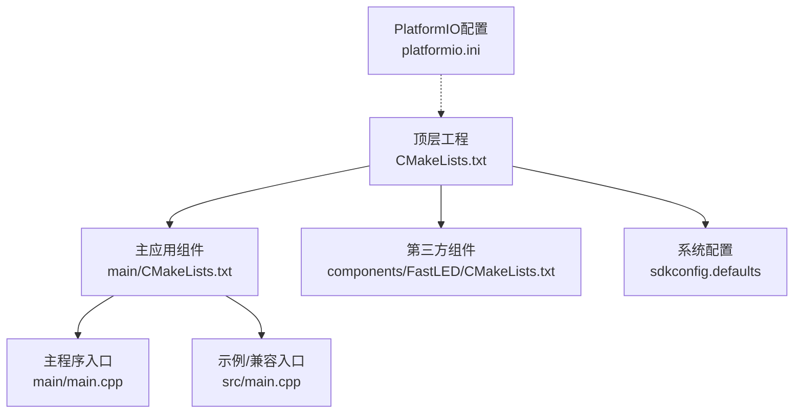
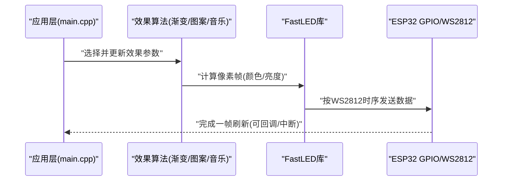
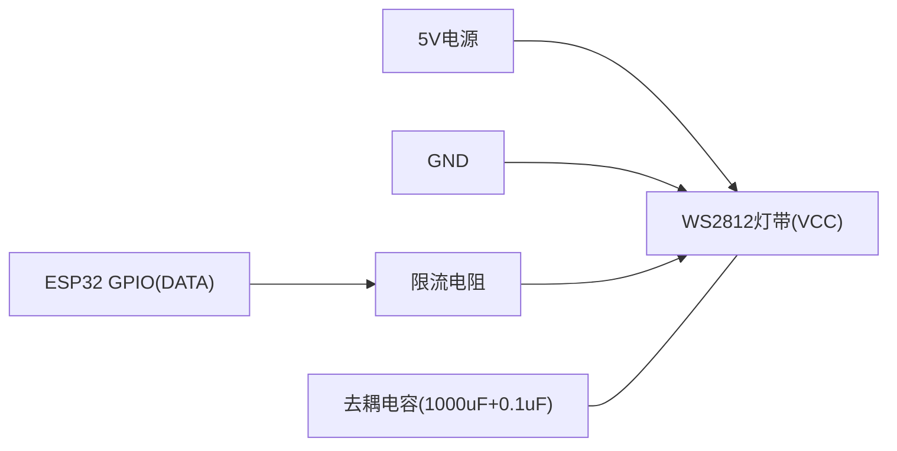
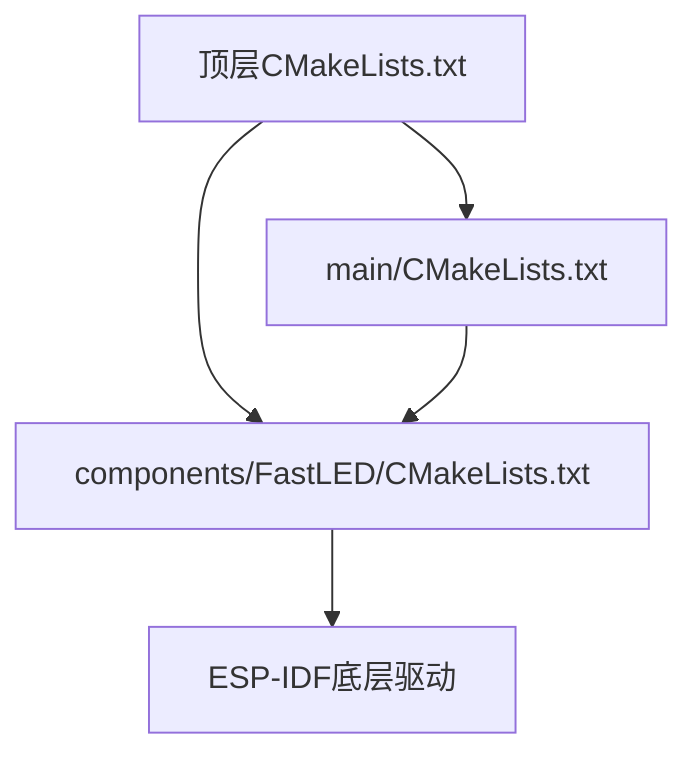

# LED灯带控制模块

<cite>
**本文引用的文件**   
- [CMakeLists.txt](file://CMakeLists.txt)
- [main/CMakeLists.txt](file://main/CMakeLists.txt)
- [components/FastLED/CMakeLists.txt](file://components/FastLED/CMakeLists.txt)
- [platformio.ini](file://platformio.ini)
- [sdkconfig.defaults](file://sdkconfig.defaults)
</cite>

## 目录
1. [简介](#简介)
2. [项目结构](#项目结构)
3. [核心组件](#核心组件)
4. [架构总览](#架构总览)
5. [详细组件分析](#详细组件分析)
6. [依赖关系分析](#依赖关系分析)
7. [性能考虑](#性能考虑)
8. [故障排查指南](#故障排查指南)
9. [结论](#结论)
10. [附录](#附录)

## 简介
本模块面向ESP32平台，基于FastLED库实现WS2812系列可编程RGB LED灯带的像素级控制。文档聚焦于：
- FastLED集成与配置要点（含CMake构建）
- WS2812通信协议、GPIO引脚与时序要求
- 常见LED效果算法（颜色渐变、动态图案、音乐响应等）
- 像素级控制、亮度调节与色彩空间转换
- 硬件接线、电源管理与信号完整性建议
- 性能优化（DMA、内存管理、实时渲染）
- 自定义效果与扩展开发指南

## 项目结构
仓库采用ESP-IDF工程组织方式，包含顶层CMake、主应用组件、第三方组件FastLED以及PlatformIO配置文件。关键目录与职责如下：
- components/FastLED: 第三方FastLED库的组件化集成入口（CMakeLists.txt）
- main: 主应用组件（CMakeLists.txt、idf_component.yml、main.cpp）
- src/main.cpp: 示例或兼容入口（若使用PlatformIO）
- CMakeLists.txt: 顶层工程构建脚本
- platformio.ini: PlatformIO环境配置（可选）
- sdkconfig.defaults: ESP-IDF默认系统配置

图表来源
- [CMakeLists.txt](file://CMakeLists.txt)
- [main/CMakeLists.txt](file://main/CMakeLists.txt)
- [components/FastLED/CMakeLists.txt](file://components/FastLED/CMakeLists.txt)
- [platformio.ini](file://platformio.ini)
- [sdkconfig.defaults](file://sdkconfig.defaults)

章节来源
- [CMakeLists.txt](file://CMakeLists.txt)
- [main/CMakeLists.txt](file://main/CMakeLists.txt)
- [components/FastLED/CMakeLists.txt](file://components/FastLED/CMakeLists.txt)
- [platformio.ini](file://platformio.ini)
- [sdkconfig.defaults](file://sdkconfig.defaults)

## 核心组件
- FastLED库集成
  - 通过components/FastLED/CMakeLists.txt将FastLED作为ESP-IDF组件引入，便于在main组件中直接调用其API。
  - 建议在main/CMakeLists.txt中声明对FastLED组件的依赖，确保编译链接正确。
- 主应用入口
  - main/main.cpp为ESP-IDF标准入口点，负责初始化系统、配置GPIO、创建并运行LED效果任务/循环。
  - src/main.cpp可作为PlatformIO兼容入口或示例代码位置。
- 构建与配置
  - CMakeLists.txt定义顶层工程、组件注册与目标生成。
  - sdkconfig.defaults提供默认系统选项（如CPU频率、堆栈大小、外设驱动开关）。
  - platformio.ini用于PlatformIO用户快速构建与调试。

章节来源
- [main/CMakeLists.txt](file://main/CMakeLists.txt)
- [components/FastLED/CMakeLists.txt](file://components/FastLED/CMakeLists.txt)
- [CMakeLists.txt](file://CMakeLists.txt)
- [sdkconfig.defaults](file://sdkconfig.defaults)
- [platformio.ini](file://platformio.ini)

## 架构总览
整体数据流从应用层效果算法到FastLED底层时序输出，最终由ESP32 GPIO驱动WS2812灯带。

图表来源
- [main/CMakeLists.txt](file://main/CMakeLists.txt)
- [components/FastLED/CMakeLists.txt](file://components/FastLED/CMakeLists.txt)

## 详细组件分析

### FastLED集成与CMake构建
- 组件化集成
  - 在components/FastLED/CMakeLists.txt中定义FastLED组件，供ESP-IDF识别与编译。
  - 在main/CMakeLists.txt中通过target_link_libraries或add_dependencies关联FastLED，确保符号链接成功。
- 顶层CMake
  - CMakeLists.txt负责设置ESP-IDF工程属性、添加组件路径、生成可执行目标。
- PlatformIO兼容
  - platformio.ini可用于非ESP-IDF环境的快速构建；若使用ESP-IDF，则优先以CMake为主。

章节来源
- [components/FastLED/CMakeLists.txt](file://components/FastLED/CMakeLists.txt)
- [main/CMakeLists.txt](file://main/CMakeLists.txt)
- [CMakeLists.txt](file://CMakeLists.txt)
- [platformio.ini](file://platformio.ini)

### WS2812通信协议与时序
- 协议要点
  - 单总线NRZ编码，数据位“0”和“1”由不同的高/低电平持续时间表示。
  - 典型波特率约800kbps，复位需满足最低低电平时间。
- 时序约束
  - 高/低电平宽度容差较小，需严格遵循WS2812规范。
  - 多灯串联时，数据串行传递，每颗灯读取24位后转发剩余数据。
- 注意事项
  - 避免在中断服务程序中执行耗时操作，防止破坏时序。
  - 长距离传输需考虑信号衰减与反射，必要时加入缓冲器或终端匹配。

章节来源
- [components/FastLED/CMakeLists.txt](file://components/FastLED/CMakeLists.txt)

### GPIO引脚配置与数据传输
- 引脚选择
  - 选择任意可用GPIO作为数据输出引脚，避免与串口、SPI等冲突。
  - 推荐远离高频噪声源，走线尽量短且直。
- 数据传输
  - 使用FastLED提供的接口进行帧写入，内部会处理时序与位打包。
  - 批量更新时建议一次性提交整帧，减少多次调用带来的抖动。

章节来源
- [components/FastLED/CMakeLists.txt](file://components/FastLED/CMakeLists.txt)

### 像素级控制、亮度与色彩空间
- 像素级控制
  - 每个像素通常由R/G/B三通道组成，支持独立设置颜色与亮度。
  - 可通过索引访问像素数组，实现逐点绘制。
- 亮度调节
  - 线性或非线性亮度映射，注意人眼感知特性，避免过曝或暗部细节丢失。
- 色彩空间转换
  - 可在HSV/HSL等空间中进行平滑过渡与色相旋转，再转回RGB输出。

章节来源
- [components/FastLED/CMakeLists.txt](file://components/FastLED/CMakeLists.txt)

### 效果算法实现
- 颜色渐变
  - 基于色相环插值，实现平滑过渡与呼吸效果。
- 动态图案
  - 波浪、螺旋、随机粒子等，结合时间变量与噪声函数增强自然感。
- 音乐响应
  - 采集音频输入（ADC或I2S），做FFT或包络检测，映射到亮度/色相变化。
- 实现建议
  - 将效果封装为可替换模块，统一接口以便切换与组合。
  - 使用固定时间步长或定时器触发，保证动画稳定。

章节来源
- [components/FastLED/CMakeLists.txt](file://components/FastLED/CMakeLists.txt)

### 硬件接线图与电源管理
- 接线建议
  - VCC接5V电源（根据灯带规格），GND共地，DATA接所选GPIO。
  - 在DATA线与灯带之间串接限流电阻（常见330Ω~470Ω），并在VCC与GND间并联去耦电容（如1000μF+0.1μF）。
- 电源管理
  - 估算最大功耗：电流≈每像素峰值电流×像素数，留足余量。
  - 分段供电与就近去耦，避免电压跌落导致闪烁。
- 信号完整性
  - 长距离传输加信号缓冲器（如74AHCT125）或中继节点。
  - 避免与强电走线平行，减小干扰。

[此图为概念性示意，不直接映射具体源码文件]

### 性能优化技巧
- DMA传输
  - 利用ESP32的DMA能力降低CPU占用，提升刷新稳定性。
- 内存管理
  - 预分配像素缓冲区，避免运行时频繁分配造成抖动。
  - 使用环形缓冲或双缓冲策略，减少锁竞争。
- 实时渲染
  - 将效果计算与显示分离，采用任务/队列解耦。
  - 限制每帧计算复杂度，必要时降采样或分块渲染。

章节来源
- [components/FastLED/CMakeLists.txt](file://components/FastLED/CMakeLists.txt)

### 自定义LED效果与扩展开发指南
- 设计模式
  - 抽象效果接口：统一update(frame, time)方法，返回像素帧。
  - 组合式效果：将基础效果（渐变、闪烁、粒子）组合成复合效果。
- 扩展点
  - 新增传感器输入（麦克风、光敏、陀螺仪）驱动效果参数。
  - 增加网络/蓝牙控制接口，远程切换效果与参数。
- 测试与调试
  - 提供小段灯带仿真模式，便于无硬件验证。
  - 记录关键指标（FPS、CPU占用、内存峰值）辅助调优。

章节来源
- [components/FastLED/CMakeLists.txt](file://components/FastLED/CMakeLists.txt)

## 依赖关系分析
- 组件依赖
  - main组件依赖FastLED组件，后者依赖ESP-IDF底层驱动（GPIO、DMA等）。
- 构建依赖
  - 顶层CMake聚合各组件，生成可执行目标；PlatformIO配置仅用于特定工具链。

图表来源
- [CMakeLists.txt](file://CMakeLists.txt)
- [main/CMakeLists.txt](file://main/CMakeLists.txt)
- [components/FastLED/CMakeLists.txt](file://components/FastLED/CMakeLists.txt)

章节来源
- [CMakeLists.txt](file://CMakeLists.txt)
- [main/CMakeLists.txt](file://main/CMakeLists.txt)
- [components/FastLED/CMakeLists.txt](file://components/FastLED/CMakeLists.txt)

## 性能考虑
- 刷新频率与延迟
  - 合理设置刷新周期，平衡视觉流畅度与功耗。
- 内存与缓存
  - 使用连续内存块存储像素数据，提高缓存命中率。
- 并行与异步
  - 将数据采集、效果计算、帧输出拆分到不同任务，避免阻塞。
- 功耗与热管理
  - 动态调整亮度上限，避免长时间满功率运行导致过热。

[本节为通用指导，不直接分析具体文件]

## 故障排查指南
- 常见问题
  - 灯带闪烁或不亮：检查电源容量、共地与限流电阻。
  - 颜色异常：确认GPIO时序与FastLED配置一致。
  - 卡顿或掉帧：评估CPU占用与内存分配，启用DMA与双缓冲。
- 定位方法
  - 分段打印关键指标（帧率、耗时、错误码）。
  - 缩小问题范围（减少像素数量、简化效果）。
- 恢复策略
  - 自动重启与状态恢复，保存最后有效配置。

章节来源
- [components/FastLED/CMakeLists.txt](file://components/FastLED/CMakeLists.txt)

## 结论
本模块通过FastLED与ESP-IDF组件化集成，提供了可扩展的WS2812灯带控制方案。借助合理的硬件设计与性能优化策略，可实现稳定、高效的像素级视觉效果。开发者可按指南扩展更多效果与交互能力，满足不同应用场景需求。

[本节为总结性内容，不直接分析具体文件]

## 附录
- 术语表
  - NRZ：不归零编码
  - DMA：直接存储器访问
  - HSV/HSL：常用色彩空间模型
- 参考资源
  - WS2812官方时序文档
  - FastLED官方文档与示例
  - ESP-IDF GPIO与DMA驱动说明

[本节为补充信息，不直接分析具体文件]