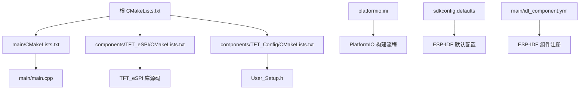
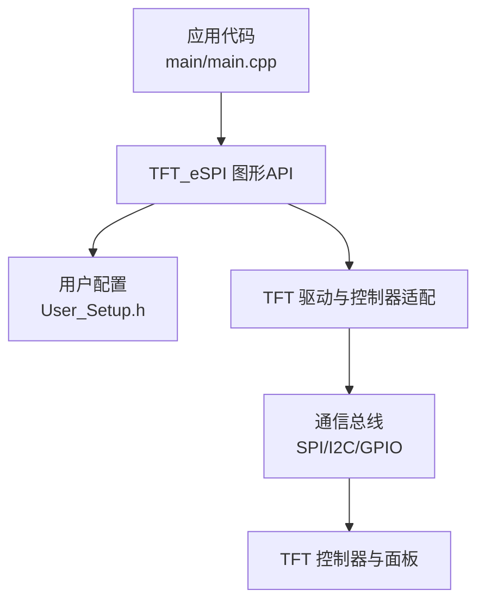
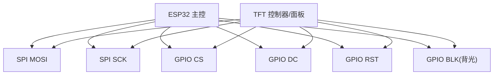
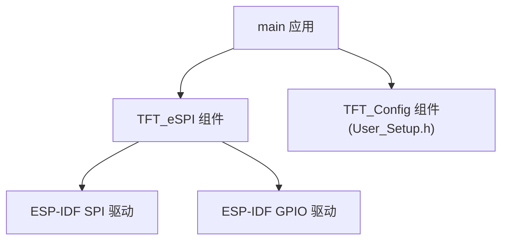

# TFT显示模块

<cite>
**本文引用的文件**   
- [User_Setup.h](file://components/TFT_Config/User_Setup.h)
- [CMakeLists.txt](file://components/TFT_eSPI/CMakeLists.txt)
- [CMakeLists.txt](file://components/TFT_Config/CMakeLists.txt)
- [CMakeLists.txt](file://main/CMakeLists.txt)
- [CMakeLists.txt](file://CMakeLists.txt)
- [idf_component.yml](file://main/idf_component.yml)
- [platformio.ini](file://platformio.ini)
- [sdkconfig.defaults](file://sdkconfig.defaults)
</cite>

## 目录
1. [简介](#简介)
2. [项目结构](#项目结构)
3. [核心组件](#核心组件)
4. [架构总览](#架构总览)
5. [详细组件分析](#详细组件分析)
6. [依赖关系分析](#依赖关系分析)
7. [性能考虑](#性能考虑)
8. [故障排除指南](#故障排除指南)
9. [结论](#结论)
10. [附录](#附录)

## 简介
本文件面向使用ESP32平台与TFT_eSPI库的开发者，系统化说明TFT显示模块的配置、集成与使用。重点覆盖以下内容：
- User_Setup.h中的硬件参数配置（分辨率、引脚映射、颜色深度、通信接口）
- TFT_eSPI库在ESP-IDF与PlatformIO环境下的集成方式与CMake构建配置
- 显示驱动工作原理（帧缓冲管理、图形绘制API、性能优化技术）
- 常见显示效果实现示例（文本、图形、动画）
- 硬件连接图、故障排除与性能调优建议
- 自定义显示效果与扩展功能的开发指导

## 项目结构
仓库采用分层组织：应用层位于main，组件层位于components，其中TFT相关配置与库分别独立为组件，便于复用与替换。

图表来源
- [CMakeLists.txt](file://CMakeLists.txt)
- [CMakeLists.txt](file://main/CMakeLists.txt)
- [CMakeLists.txt](file://components/TFT_eSPI/CMakeLists.txt)
- [CMakeLists.txt](file://components/TFT_Config/CMakeLists.txt)
- [idf_component.yml](file://main/idf_component.yml)
- [platformio.ini](file://platformio.ini)
- [sdkconfig.defaults](file://sdkconfig.defaults)

章节来源
- [CMakeLists.txt](file://CMakeLists.txt)
- [CMakeLists.txt](file://main/CMakeLists.txt)
- [CMakeLists.txt](file://components/TFT_eSPI/CMakeLists.txt)
- [CMakeLists.txt](file://components/TFT_Config/CMakeLists.txt)
- [idf_component.yml](file://main/idf_component.yml)
- [platformio.ini](file://platformio.ini)
- [sdkconfig.defaults](file://sdkconfig.defaults)

## 核心组件
- 用户配置头文件：用于定义屏幕型号、分辨率、引脚映射、颜色深度、通信接口等关键参数。
- TFT_eSPI库：提供高效的TFT/LCD驱动与图形API，支持多种控制器与总线协议。
- CMake/ESP-IDF集成：通过组件化方式将TFT_eSPI与用户配置纳入构建系统。
- PlatformIO集成：通过配置文件指定工具链、框架与组件路径。

章节来源
- [User_Setup.h](file://components/TFT_Config/User_Setup.h)
- [CMakeLists.txt](file://components/TFT_eSPI/CMakeLists.txt)
- [CMakeLists.txt](file://components/TFT_Config/CMakeLists.txt)
- [CMakeLists.txt](file://main/CMakeLists.txt)
- [idf_component.yml](file://main/idf_component.yml)
- [platformio.ini](file://platformio.ini)

## 架构总览
下图展示了从应用到硬件的调用链路：应用层调用TFT_eSPI提供的图形API，TFT_eSPI根据User_Setup.h中的配置选择具体驱动与总线，最终通过ESP32外设（如SPI/I2C/GPIO）驱动TFT控制器。

图表来源
- [User_Setup.h](file://components/TFT_Config/User_Setup.h)
- [CMakeLists.txt](file://components/TFT_eSPI/CMakeLists.txt)
- [CMakeLists.txt](file://components/TFT_Config/CMakeLists.txt)

## 详细组件分析

### 用户配置（User_Setup.h）
该文件集中定义了TFT显示相关的硬件参数，是TFT_eSPI库行为的关键开关。典型配置项包括：
- 屏幕分辨率：宽×高像素数
- 控制器型号：对应不同TFT控制器的初始化序列
- 引脚映射：CS、DC、RST、BLK、MOSI、SCK、MISO等GPIO编号
- 颜色深度：RGB565或RGB888
- 通信接口：SPI或I2C，以及SPI频率、DMA选项
- 触摸屏（可选）：XPT2046等控制器及其引脚

建议按实际硬件逐一核对并启用相应宏定义，避免未使用的功能占用资源。

章节来源
- [User_Setup.h](file://components/TFT_Config/User_Setup.h)

### 构建系统与集成（CMake/ESP-IDF/PlatformIO）
- ESP-IDF组件化
  - components/TFT_eSPI/CMakeLists.txt：声明TFT_eSPI为组件，供上层链接与编译。
  - components/TFT_Config/CMakeLists.txt：声明用户配置组件，确保User_Setow.h包含路径正确。
  - main/CMakeLists.txt：将应用与上述组件关联，生成可执行目标。
  - 根CMakeLists.txt：统一入口，递归包含子组件。
  - idf_component.yml：注册组件元数据，便于ESP-IDF组件管理器解析。
- PlatformIO
  - platformio.ini：指定框架、板卡、工具链与组件路径，保证User_Setup.h与TFT_eSPI被正确编译与链接。
- SDK默认配置
  - sdkconfig.defaults：设置ESP-IDF全局默认项（如SPI DMA、时钟源等），影响TFT总线性能与稳定性。

章节来源
- [CMakeLists.txt](file://components/TFT_eSPI/CMakeLists.txt)
- [CMakeLists.txt](file://components/TFT_Config/CMakeLists.txt)
- [CMakeLists.txt](file://main/CMakeLists.txt)
- [CMakeLists.txt](file://CMakeLists.txt)
- [idf_component.yml](file://main/idf_component.yml)
- [platformio.ini](file://platformio.ini)
- [sdkconfig.defaults](file://sdkconfig.defaults)

### 显示驱动工作原理
- 帧缓冲管理
  - 单缓冲模式：每次绘制后直接推送到显存，内存占用低，适合小屏或资源受限场景。
  - 双缓冲模式：后台缓冲区绘制完成后一次性交换，减少闪烁，适合动画与复杂UI。
  - 部分刷新：仅更新矩形区域，降低带宽压力。
- 图形绘制API
  - 基础图元：点、线、矩形、圆、三角形等。
  - 文本渲染：字体选择、字号、对齐、滚动窗口。
  - 图像显示：位图、图标、图片切片。
- 性能优化技术
  - SPI DMA传输：批量发送像素数据，降低CPU占用。
  - 行/列范围裁剪：只写入可见区域。
  - 颜色格式选择：RGB565在带宽与色彩间取得平衡。
  - 预取与批处理：合并多次绘制命令，减少总线开销。

章节来源
- [User_Setup.h](file://components/TFT_Config/User_Setup.h)
- [CMakeLists.txt](file://components/TFT_eSPI/CMakeLists.txt)

### 常见显示效果实现示例
以下为典型效果的步骤指引（不展示具体代码，请结合TFT_eSPI文档与User_Setup.h配置进行实现）：
- 文本显示
  - 初始化TFT与字体
  - 设置背景色与前景色
  - 定位光标位置并输出字符串
  - 必要时启用局部刷新以提升性能
- 图形绘制
  - 绘制基本图元（线、矩形、圆）
  - 组合多个图元形成仪表盘或波形
  - 使用抗锯齿或抖动算法提升观感（视需求开启）
- 动画效果
  - 使用双缓冲或滚动窗口实现平滑过渡
  - 控制帧率与刷新区域，避免全屏重绘
  - 利用定时器或任务调度触发刷新

章节来源
- [User_Setup.h](file://components/TFT_Config/User_Setup.h)
- [CMakeLists.txt](file://components/TFT_eSPI/CMakeLists.txt)

### 硬件连接图
以下图示给出常见的SPI连接方式（以ESP32为例）。请根据User_Setup.h中定义的引脚调整连线。

[此图为概念性连接示意，无需列出图表来源]

## 依赖关系分析
- 组件耦合
  - main应用依赖TFT_eSPI组件与User_Setup配置。
  - TFT_eSPI组件依赖ESP-IDF底层SPI/I2C与GPIO驱动。
- 外部依赖
  - ESP-IDF框架与工具链
  - PlatformIO（若使用该构建系统）
- 潜在循环依赖
  - 组件化结构避免了循环依赖；确保User_Setup.h仅作为配置头被包含，不包含业务逻辑。

图表来源
- [CMakeLists.txt](file://main/CMakeLists.txt)
- [CMakeLists.txt](file://components/TFT_eSPI/CMakeLists.txt)
- [CMakeLists.txt](file://components/TFT_Config/CMakeLists.txt)

章节来源
- [CMakeLists.txt](file://main/CMakeLists.txt)
- [CMakeLists.txt](file://components/TFT_eSPI/CMakeLists.txt)
- [CMakeLists.txt](file://components/TFT_Config/CMakeLists.txt)

## 性能考虑
- 总线与DMA
  - 启用SPI DMA以降低CPU负载，提高吞吐。
  - 合理设置SPI时钟频率，兼顾速度与信号完整性。
- 刷新策略
  - 优先使用局部刷新与滚动窗口，避免全屏重绘。
  - 对静态内容缓存，动态内容增量更新。
- 颜色与内存
  - RGB565在带宽与色彩之间取得较好平衡。
  - 大图像分块加载与压缩存储，减少RAM占用。
- 任务与调度
  - 将刷新放入独立任务，避免阻塞主循环。
  - 使用队列或事件机制协调UI与传感器数据刷新。

[本节为通用指导，无需列出章节来源]

## 故障排除指南
- 屏幕无显示
  - 检查User_Setup.h中控制器型号与分辨率是否匹配。
  - 确认引脚映射与实际连线一致，尤其是CS、DC、RST、BLK。
  - 验证供电与背光电压，必要时增加去耦电容。
- 花屏或错位
  - 检查SPI频率是否过高导致信号失真。
  - 确认数据线长度与走线质量，避免强干扰。
- 触摸异常（如启用）
  - 校验触摸控制器型号与引脚。
  - 校准触摸坐标映射，修正偏移与缩放。
- 构建错误
  - 确认CMakeLists.txt已正确包含TFT_eSPI与User_Setup组件。
  - PlatformIO环境下检查platformio.ini的框架与组件路径。
  - ESP-IDF环境下检查idf_component.yml与sdkconfig.defaults。

章节来源
- [User_Setup.h](file://components/TFT_Config/User_Setup.h)
- [CMakeLists.txt](file://components/TFT_eSPI/CMakeLists.txt)
- [CMakeLists.txt](file://components/TFT_Config/CMakeLists.txt)
- [CMakeLists.txt](file://main/CMakeLists.txt)
- [platformio.ini](file://platformio.ini)
- [sdkconfig.defaults](file://sdkconfig.defaults)

## 结论
通过合理的User_Setup.h配置与规范的CMake/ESP-IDF集成，TFT_eSPI可在ESP32平台上高效驱动各类TFT面板。遵循局部刷新、DMA传输与任务调度等优化策略，可获得流畅的UI体验。建议在项目中保持配置与驱动的解耦，便于移植与扩展。

[本节为总结性内容，无需列出章节来源]

## 附录
- 自定义显示效果
  - 基于现有图形API封装高级控件（进度条、滑块、图表）。
  - 引入轻量级字体与图标资源，按需加载。
  - 使用状态机管理界面切换与动画时序。
- 扩展功能
  - 添加文件系统读取图片与字体，实现主题切换。
  - 接入网络时间与服务端推送，丰富UI信息源。
  - 增加日志与调试输出，辅助定位问题。

[本节为扩展指导，无需列出章节来源]