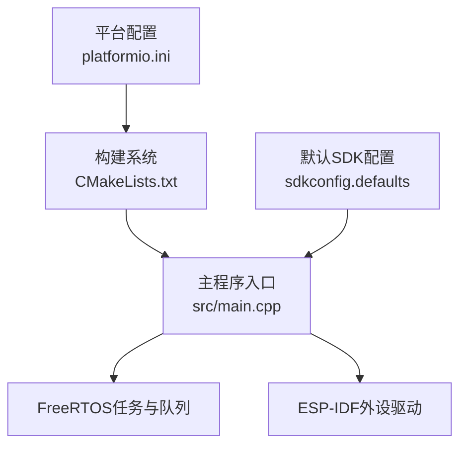
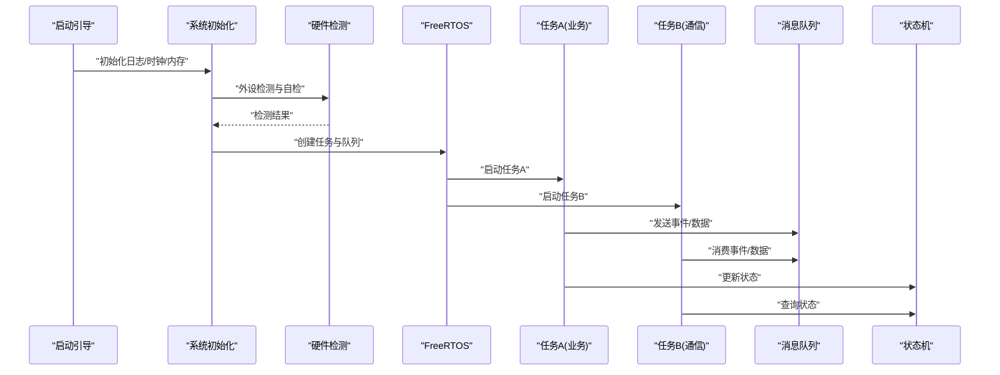
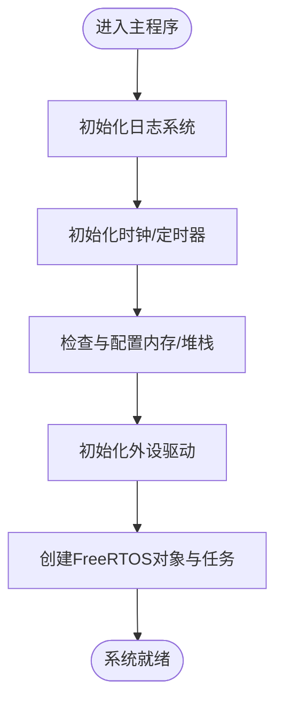
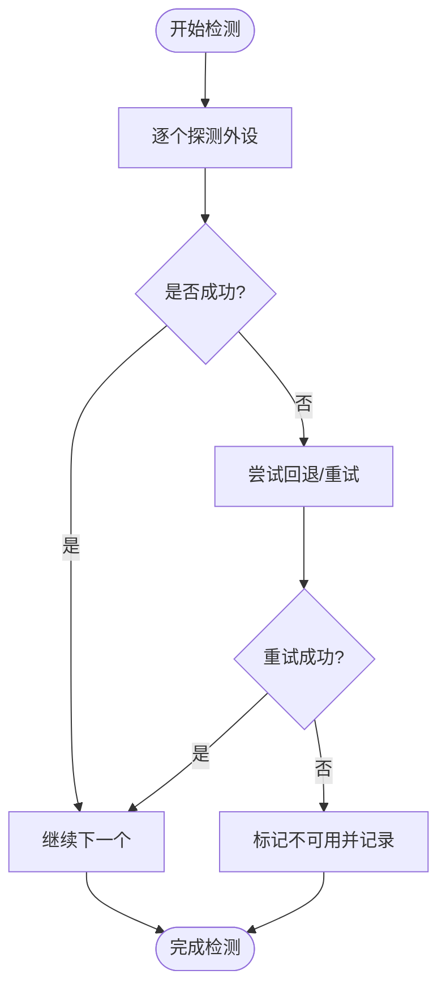
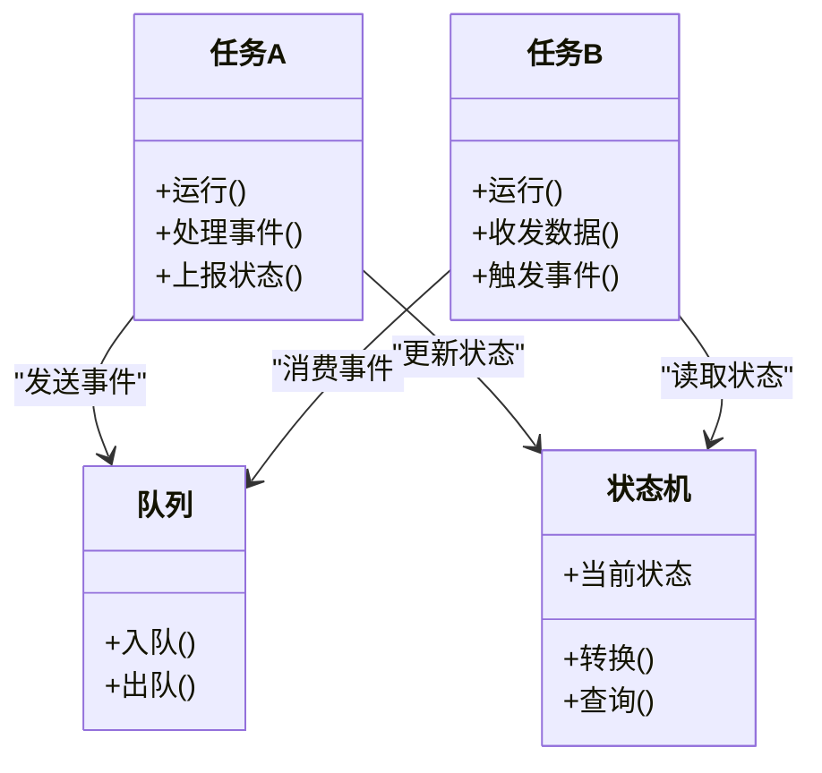
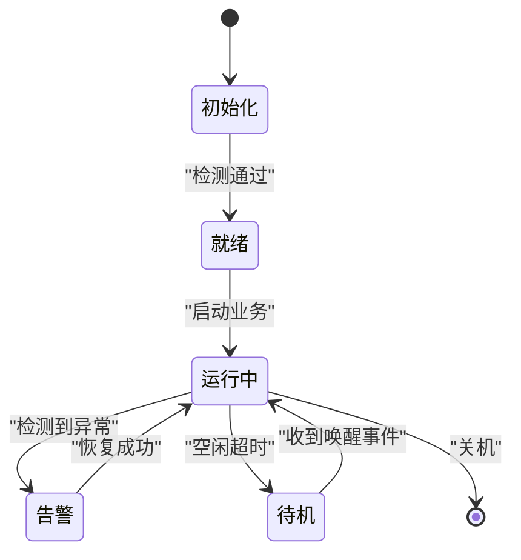
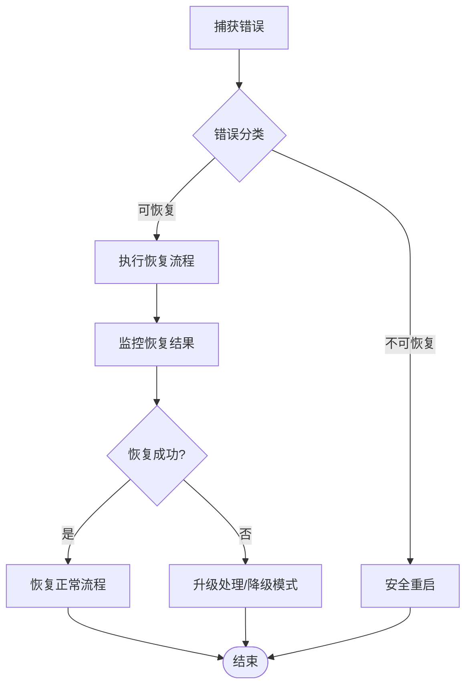
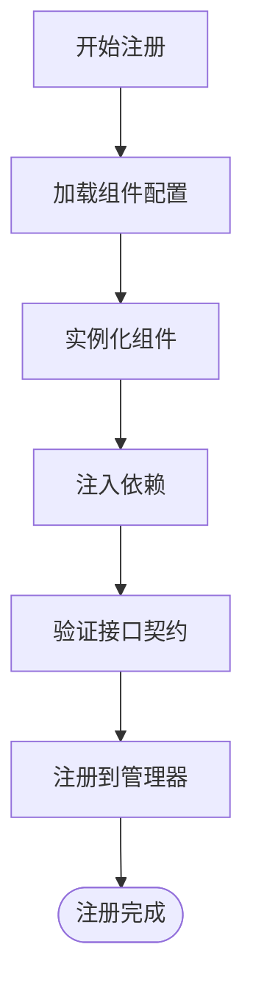
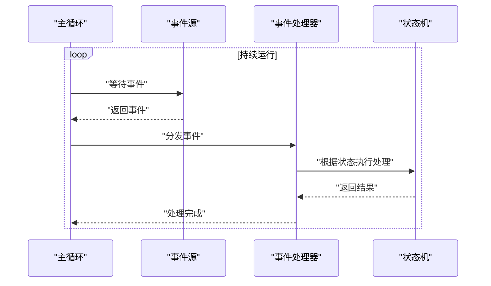
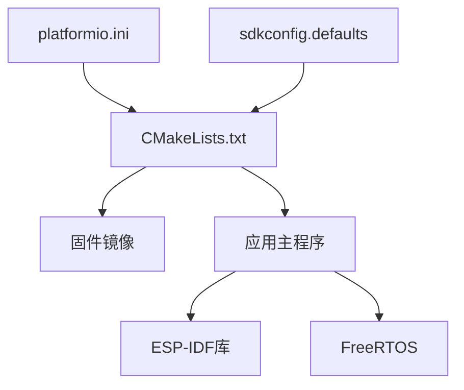

# 主程序模块

<cite>
**本文引用的文件**   
- [main.cpp](file://src/main.cpp)
- [CMakeLists.txt](file://CMakeLists.txt)
- [platformio.ini](file://platformio.ini)
- [sdkconfig.defaults](file://sdkconfig.defaults)
</cite>

## 目录
1. [简介](#简介)
2. [项目结构](#项目结构)
3. [核心组件](#核心组件)
4. [架构总览](#架构总览)
5. [详细组件分析](#详细组件分析)
6. [依赖关系分析](#依赖关系分析)
7. [性能考虑](#性能考虑)
8. [故障排查指南](#故障排查指南)
9. [结论](#结论)
10. [附录](#附录)

## 简介
本文件面向ESP32中心节点的主程序模块，聚焦于系统初始化流程、任务与事件机制、状态管理与错误恢复策略，并提供扩展新功能的实践指导。文档以代码级分析为基础，结合可视化图示帮助读者快速理解整体架构与关键路径。

## 项目结构
仓库采用典型的ESP-IDF/PlatformIO工程布局：
- src/main.cpp：主程序入口，包含系统初始化、外设检测、任务创建与主循环逻辑。
- CMakeLists.txt：顶层构建配置，定义目标、组件与编译选项。
- platformio.ini：PlatformIO环境配置，指定工具链、框架版本与调试参数。
- sdkconfig.defaults：默认SDK配置，影响内存、堆栈、日志与外设行为。

图表来源
- [CMakeLists.txt](file://CMakeLists.txt)
- [platformio.ini](file://platformio.ini)
- [sdkconfig.defaults](file://sdkconfig.defaults)
- [main.cpp](file://src/main.cpp)

章节来源
- [CMakeLists.txt](file://CMakeLists.txt)
- [platformio.ini](file://platformio.ini)
- [sdkconfig.defaults](file://sdkconfig.defaults)
- [main.cpp](file://src/main.cpp)

## 核心组件
本节概述主程序中的关键子系统及其职责：
- 系统初始化：完成日志、时钟、内存与外设的早期初始化，建立运行环境。
- 硬件外设检测：对关键外设进行可用性探测与自检，确保后续功能可用。
- 内存管理：监控堆栈使用，避免溢出；合理分配静态与动态资源。
- 任务调度：基于FreeRTOS创建多任务，实现并发处理与解耦。
- 事件与消息：通过队列或事件组在任务间传递数据与状态变更。
- 状态机：集中管理设备运行状态，提供一致的状态转换接口。
- 错误恢复：捕获异常并执行降级或重启策略，保障系统鲁棒性。

章节来源
- [main.cpp](file://src/main.cpp)

## 架构总览
下图展示了主程序的整体架构与交互关系，包括初始化阶段、运行时任务与事件流。

图表来源
- [main.cpp](file://src/main.cpp)

## 详细组件分析

### 系统初始化流程
- 日志与诊断：启用统一日志输出，便于定位问题。
- 时钟与定时器：初始化系统时钟与所需定时器，为延时与周期任务提供基础。
- 内存与堆栈：检查可用堆大小，必要时调整配置以避免碎片化与溢出。
- 外设驱动：按需初始化串口、I2C/SPI、GPIO等，完成引脚复用与中断配置。
- FreeRTOS：创建内核对象（队列、信号量、事件组），注册任务入口函数。

图表来源
- [main.cpp](file://src/main.cpp)

章节来源
- [main.cpp](file://src/main.cpp)

### 硬件外设检测
- 检测范围：覆盖关键总线与传感器/显示/通信模块。
- 检测策略：上电后顺序探测，记录失败项并尝试回退方案。
- 结果上报：将检测结果写入全局状态，供任务层决策。

图表来源
- [main.cpp](file://src/main.cpp)

章节来源
- [main.cpp](file://src/main.cpp)

### 内存管理与任务调度
- 内存策略：优先使用静态分配，减少动态分配带来的不确定性；定期打印堆剩余空间。
- 任务设计：按职责拆分任务，控制优先级与栈大小，避免高优先级任务阻塞。
- 同步机制：使用队列/信号量/事件组进行任务间通信与同步，降低耦合。

图表来源
- [main.cpp](file://src/main.cpp)

章节来源
- [main.cpp](file://src/main.cpp)

### 事件处理与状态管理
- 事件模型：以事件为中心，任务通过队列或事件组发布/订阅，实现松耦合。
- 状态机：集中维护设备状态，提供一致的转换接口与边界检查。
- 错误传播：事件中包含错误码与上下文，便于上层统一处理。

图表来源
- [main.cpp](file://src/main.cpp)

章节来源
- [main.cpp](file://src/main.cpp)

### 错误恢复策略
- 分级处理：区分可恢复与不可恢复错误，前者尝试局部修复，后者触发安全重启。
- 降级模式：在部分外设不可用时切换到最小可用功能集。
- 观测与记录：记录错误上下文与时间戳，支持离线分析与在线告警。

图表来源
- [main.cpp](file://src/main.cpp)

章节来源
- [main.cpp](file://src/main.cpp)

### 组件注册与依赖注入
- 组件注册：在主初始化阶段集中注册各功能模块，暴露统一接口。
- 依赖注入：通过配置表或工厂方法注入依赖，避免硬编码耦合。
- 生命周期：明确组件的初始化、运行与销毁阶段，保证有序启停。

图表来源
- [main.cpp](file://src/main.cpp)

章节来源
- [main.cpp](file://src/main.cpp)

### 主循环架构设计
- 事件驱动：主循环不直接执行业务逻辑，而是等待事件并分发给对应处理器。
- 状态守卫：在进入关键路径前校验状态，防止非法操作。
- 心跳与看门狗：周期性刷新心跳，喂狗以防止意外复位。

图表来源
- [main.cpp](file://src/main.cpp)

章节来源
- [main.cpp](file://src/main.cpp)

### 扩展新功能模块的最佳实践
- 新增步骤：
  - 在组件注册表中声明新模块。
  - 实现标准接口（初始化、运行、停止）。
  - 通过依赖注入接入现有队列/事件通道。
  - 添加自检与错误上报。
- 注意事项：
  - 控制栈大小与CPU占用，避免抢占关键任务。
  - 使用非阻塞API，配合超时与重试。
  - 为每个模块设置独立日志级别，便于定位问题。

章节来源
- [main.cpp](file://src/main.cpp)

## 依赖关系分析
- 构建与配置：
  - CMakeLists.txt定义目标与组件，决定哪些源码参与编译。
  - platformio.ini指定工具链与框架版本，影响编译产物与调试能力。
  - sdkconfig.defaults提供默认SDK选项，影响内存、日志与外设行为。
- 运行时依赖：
  - ESP-IDF内核与外设驱动库。
  - FreeRTOS任务、队列与事件对象。
  - 应用层组件之间的接口契约。

图表来源
- [CMakeLists.txt](file://CMakeLists.txt)
- [platformio.ini](file://platformio.ini)
- [sdkconfig.defaults](file://sdkconfig.defaults)
- [main.cpp](file://src/main.cpp)

章节来源
- [CMakeLists.txt](file://CMakeLists.txt)
- [platformio.ini](file://platformio.ini)
- [sdkconfig.defaults](file://sdkconfig.defaults)
- [main.cpp](file://src/main.cpp)

## 性能考虑
- 任务优先级与栈大小：为高实时性任务提升优先级，并为计算密集型任务增大栈。
- 内存分配：尽量使用静态分配，减少动态分配频率；合并小对象，避免碎片。
- I/O优化：批量读写、DMA与环形缓冲区可降低CPU占用。
- 日志级别：生产环境降低日志级别，仅在关键路径输出必要信息。
- 看门狗与心跳：合理设置超时阈值，避免误报与频繁复位。

[本节为通用建议，无需特定文件引用]

## 故障排查指南
- 常见问题：
  - 启动崩溃：检查初始化顺序与外设依赖，确认堆栈未溢出。
  - 任务饥饿：调整优先级与时间片，避免长时间阻塞。
  - 死锁：审查互斥与信号量使用，确保释放路径完整。
  - 通信失败：核对引脚复用、电平与协议时序。
- 调试技巧：
  - 启用分段日志与时间戳，定位问题发生点。
  - 使用断点与单步跟踪，观察关键变量变化。
  - 导出堆统计与任务状态，分析资源占用。
- 恢复策略：
  - 针对可恢复错误执行局部重启或切换备用通道。
  - 对于不可恢复错误执行安全重启并记录现场。

章节来源
- [main.cpp](file://src/main.cpp)

## 结论
主程序模块围绕“初始化—检测—调度—事件—状态—恢复”的主线展开，通过清晰的层次划分与事件驱动模型，实现了可扩展、可维护与高可用的嵌入式系统。遵循本文档的实践建议，开发者可以高效地扩展功能并保持系统稳定。

[本节为总结性内容，无需特定文件引用]

## 附录
- 术语说明：
  - 事件：任务间异步通知的数据单元。
  - 状态机：用于管理设备运行状态的有限状态模型。
  - 依赖注入：通过外部配置或容器为组件提供依赖对象。
- 参考路径：
  - 主程序入口：[src/main.cpp](file://src/main.cpp)
  - 构建配置：[CMakeLists.txt](file://CMakeLists.txt)、[platformio.ini](file://platformio.ini)
  - SDK默认配置：[sdkconfig.defaults](file://sdkconfig.defaults)