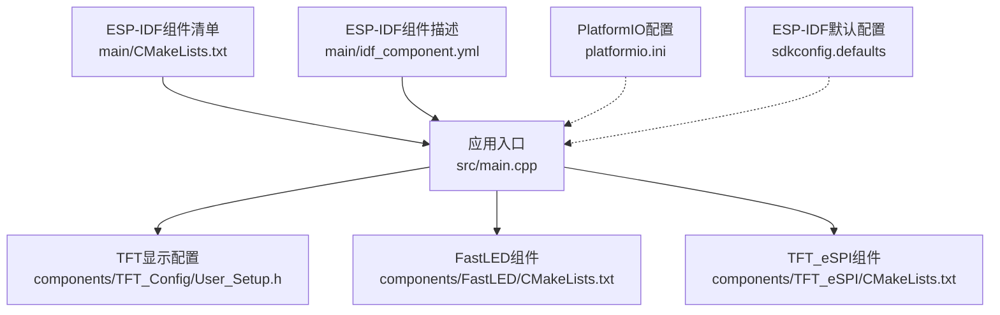
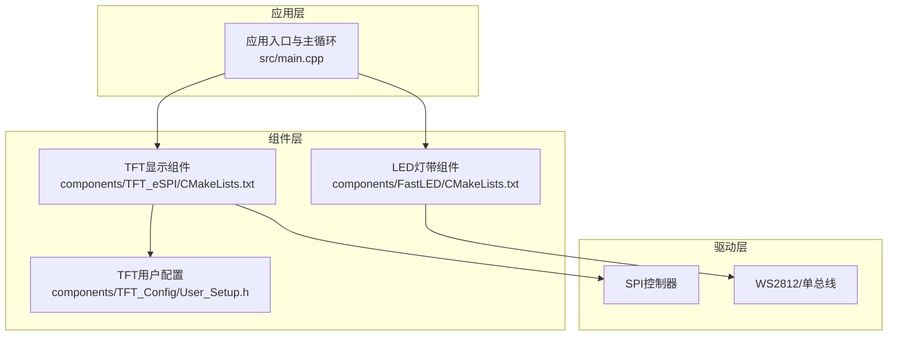
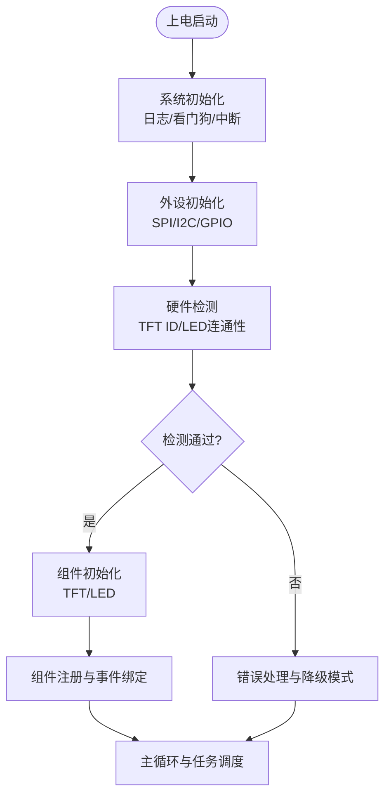
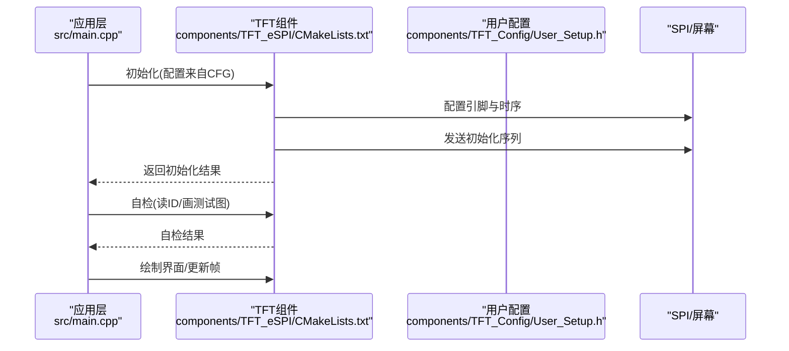
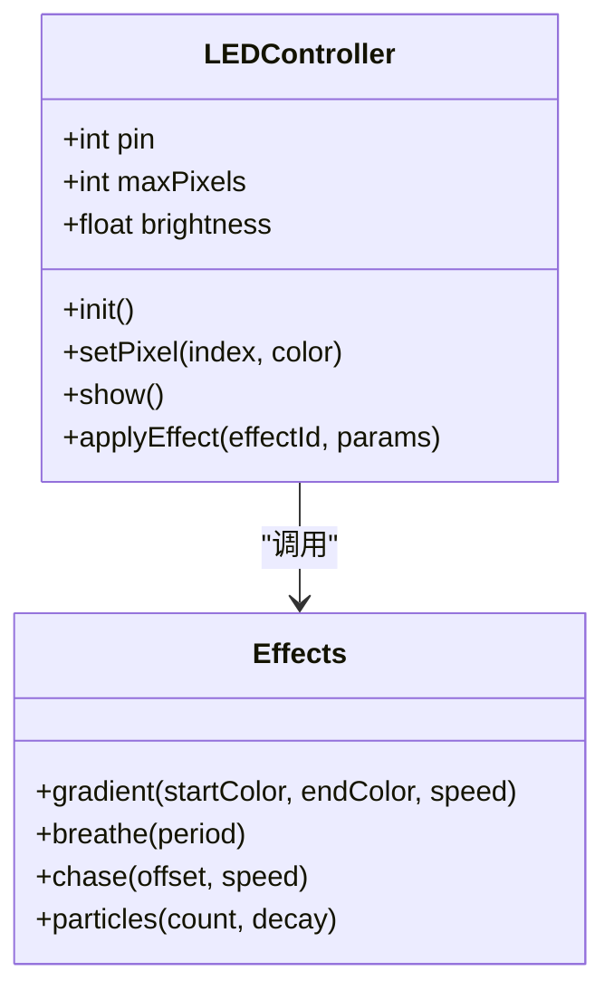
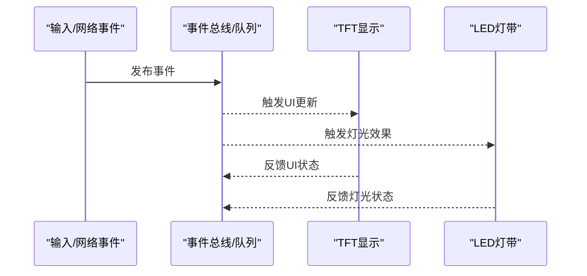
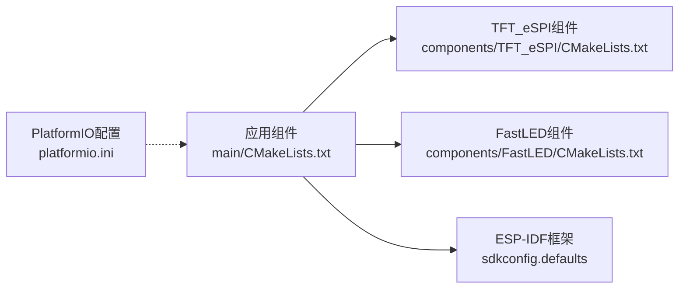

# 核心模块

<cite>
**本文引用的文件**   
- [main.cpp](file://src/main.cpp)
- [User_Setup.h](file://components/TFT_Config/User_Setup.h)
- [CMakeLists.txt](file://components/FastLED/CMakeLists.txt)
- [CMakeLists.txt](file://components/TFT_eSPI/CMakeLists.txt)
- [CMakeLists.txt](file://main/CMakeLists.txt)
- [idf_component.yml](file://main/idf_component.yml)
- [platformio.ini](file://platformio.ini)
- [sdkconfig.defaults](file://sdkconfig.defaults)
</cite>

## 目录
1. [简介](#简介)
2. [项目结构](#项目结构)
3. [核心组件](#核心组件)
4. [架构总览](#架构总览)
5. [详细组件分析](#详细组件分析)
6. [依赖关系分析](#依赖关系分析)
7. [性能考虑](#性能考虑)
8. [故障排查指南](#故障排查指南)
9. [结论](#结论)
10. [附录](#附录)

## 简介
本文件面向ESP32中心节点的核心模块实现，聚焦以下目标：
- 主程序(main.cpp)的系统初始化流程、硬件检测与组件注册过程
- TFT显示模块的实现要点：User_Setup.h硬件参数配置、显示驱动加载流程与基本显示操作
- LED灯带控制模块：FastLED库集成、GPIO引脚配置与效果编程方法
- 各模块间的通信机制与数据流
- 错误处理机制与性能优化建议
- 扩展与自定义功能的指导

说明：由于当前仓库中仅包含少量源码与构建配置文件，且工具调用受限，本文基于现有文件进行结构化分析与最佳实践总结。涉及具体代码细节处均以“章节来源”标注对应文件路径与行号范围；未直接分析的通用内容不附加来源。

## 项目结构
该工程采用分层组织方式：
- src/main.cpp：应用入口与系统初始化、设备自检、组件注册与主循环
- components/TFT_Config/User_Setup.h：TFT显示驱动的用户配置（分辨率、引脚、时序等）
- components/FastLED 与 components/TFT_eSPI：第三方库的组件化封装与CMake集成
- main/CMakeLists.txt 与 idf_component.yml：ESP-IDF组件清单与依赖声明
- platformio.ini：PlatformIO构建配置（可选）
- sdkconfig.defaults：ESP-IDF默认配置项

图表来源
- [main.cpp](file://src/main.cpp)
- [User_Setup.h](file://components/TFT_Config/User_Setup.h)
- [CMakeLists.txt](file://components/FastLED/CMakeLists.txt)
- [CMakeLists.txt](file://components/TFT_eSPI/CMakeLists.txt)
- [CMakeLists.txt](file://main/CMakeLists.txt)
- [idf_component.yml](file://main/idf_component.yml)
- [platformio.ini](file://platformio.ini)
- [sdkconfig.defaults](file://sdkconfig.defaults)

章节来源
- [main.cpp](file://src/main.cpp)
- [User_Setup.h](file://components/TFT_Config/User_Setup.h)
- [CMakeLists.txt](file://components/FastLED/CMakeLists.txt)
- [CMakeLists.txt](file://components/TFT_eSPI/CMakeLists.txt)
- [CMakeLists.txt](file://main/CMakeLists.txt)
- [idf_component.yml](file://main/idf_component.yml)
- [platformio.ini](file://platformio.ini)
- [sdkconfig.defaults](file://sdkconfig.defaults)

## 核心组件
- 应用入口与系统初始化
  - 负责日志/调试输出初始化、外设时钟与电源域配置、关键传感器或总线初始化、TFT与LED模块初始化、任务/定时器注册与主循环调度
- TFT显示子系统
  - 通过User_Setup.h完成屏幕型号、分辨率、引脚映射、SPI/I2C参数、颜色深度与刷新策略的配置
  - 在初始化阶段加载驱动并执行自检（如读ID、画测试图）
- LED灯带控制子系统
  - 使用FastLED库管理像素矩阵，配置数据引脚、亮度上限、色彩空间与更新频率
  - 提供常见效果函数（渐变、呼吸、跑马灯、粒子等）与状态机切换

章节来源
- [main.cpp](file://src/main.cpp)
- [User_Setup.h](file://components/TFT_Config/User_Setup.h)
- [CMakeLists.txt](file://components/FastLED/CMakeLists.txt)
- [CMakeLists.txt](file://components/TFT_eSPI/CMakeLists.txt)

## 架构总览
整体采用“应用层 + 组件层 + 驱动层”的分层架构：
- 应用层：业务逻辑、事件分发、UI与灯光效果编排
- 组件层：TFT与FastLED作为独立组件，暴露统一接口供应用调用
- 驱动层：由TFT_eSPI与FastLED内部驱动对接底层SPI/WS2812等外设

图表来源
- [main.cpp](file://src/main.cpp)
- [User_Setup.h](file://components/TFT_Config/User_Setup.h)
- [CMakeLists.txt](file://components/FastLED/CMakeLists.txt)
- [CMakeLists.txt](file://components/TFT_eSPI/CMakeLists.txt)

## 详细组件分析

### 主程序与系统初始化流程
- 初始化顺序建议
  - 系统级：日志/调试输出、看门狗、中断优先级、内存与堆栈检查
  - 外设级：SPI/I2C/GPIO时钟使能、引脚复用与电平设置
  - 组件级：TFT初始化与自检、LED灯带初始化与亮度限制
  - 运行时：创建任务/定时器、注册回调、进入主循环
- 硬件检测
  - 读取TFT芯片ID或回写校验图案以确认连接
  - 对LED通道进行最小长度与连通性检测（例如点亮首尾像素）
- 组件注册
  - 将TFT与LED的API封装为可插拔模块，支持动态启用/禁用
  - 事件总线或消息队列用于跨模块通知（如按键、网络事件）

章节来源
- [main.cpp](file://src/main.cpp)

### TFT显示模块
- User_Setup.h配置要点
  - 屏幕型号与分辨率、颜色深度
  - 引脚定义（CS/DC/RST/MOSI/SCK/BL等）
  - 总线类型与时序参数（SPI频率、极性与相位）
  - 旋转方向、偏移与裁剪区域
- 驱动加载流程
  - 根据配置选择驱动头与初始化序列
  - 执行读ID/画条/画点自检，失败则回退到安全模式
- 基本显示操作
  - 清屏、绘制矩形/圆/文本、位图渲染、双缓冲与部分刷新
  - 与LED联动：根据UI状态同步灯光效果

图表来源
- [User_Setup.h](file://components/TFT_Config/User_Setup.h)
- [CMakeLists.txt](file://components/TFT_eSPI/CMakeLists.txt)
- [main.cpp](file://src/main.cpp)

章节来源
- [User_Setup.h](file://components/TFT_Config/User_Setup.h)
- [CMakeLists.txt](file://components/TFT_eSPI/CMakeLists.txt)
- [main.cpp](file://src/main.cpp)

### LED灯带控制模块
- FastLED集成
  - 在组件CMakeLists中引入FastLED源与头文件路径
  - 配置全局亮度上限与色彩空间（GRB/RGB）
- GPIO引脚配置
  - 指定数据引脚、最大像素数、更新频率
  - 避免与SPI冲突，必要时调整DMA/中断策略
- 效果编程方法
  - 定义像素数组与效果函数（渐变、呼吸、跑马灯、粒子）
  - 使用定时器或任务周期性调用update()，结合状态机切换效果

图表来源
- [CMakeLists.txt](file://components/FastLED/CMakeLists.txt)
- [main.cpp](file://src/main.cpp)

章节来源
- [CMakeLists.txt](file://components/FastLED/CMakeLists.txt)
- [main.cpp](file://src/main.cpp)

### 模块间通信机制与数据流
- 事件驱动
  - 使用事件队列或回调将输入事件（按键/网络）广播至TFT与LED
- 共享状态
  - 集中维护系统状态（主题、音量、网络状态），TFT与LED订阅变化
- 资源协调
  - 避免同时高负载更新（如全屏刷新+全灯带动画），采用时间片轮转或优先级调度

[此图为概念性流程图，无需图表来源]

## 依赖关系分析
- 组件清单与构建
  - main/CMakeLists.txt声明应用组件及其依赖
  - idf_component.yml列出对外部组件的引用（TFT_eSPI、FastLED等）
  - components下各子组件的CMakeLists.txt负责自身源文件与头文件路径
- PlatformIO与ESP-IDF
  - platformio.ini可用于替代或补充构建环境
  - sdkconfig.defaults提供默认内核与外设配置

图表来源
- [CMakeLists.txt](file://main/CMakeLists.txt)
- [idf_component.yml](file://main/idf_component.yml)
- [CMakeLists.txt](file://components/FastLED/CMakeLists.txt)
- [CMakeLists.txt](file://components/TFT_eSPI/CMakeLists.txt)
- [platformio.ini](file://platformio.ini)
- [sdkconfig.defaults](file://sdkconfig.defaults)

章节来源
- [CMakeLists.txt](file://main/CMakeLists.txt)
- [idf_component.yml](file://main/idf_component.yml)
- [CMakeLists.txt](file://components/FastLED/CMakeLists.txt)
- [CMakeLists.txt](file://components/TFT_eSPI/CMakeLists.txt)
- [platformio.ini](file://platformio.ini)
- [sdkconfig.defaults](file://sdkconfig.defaults)

## 性能考虑
- 显示优化
  - 使用局部刷新与双缓冲减少带宽占用
  - 合理设置SPI频率与DMA，避免阻塞CPU
- LED优化
  - 设置合理的亮度上限与更新频率，降低功耗与发热
  - 批量更新像素，减少频繁show()调用
- 调度与并发
  - 将重任务放入低优先级任务或使用定时器分片执行
  - 避免在ISR中进行耗时操作
- 内存与堆栈
  - 监控堆碎片与栈溢出风险，预留足够余量

[本节为通用指导，无需章节来源]

## 故障排查指南
- 常见问题定位
  - TFT无显示：检查User_Setup.h引脚与时序、SPI线序与电平、复位引脚拉低时序
  - LED异常：确认数据引脚、供电能力、信号完整性与亮度上限
  - 初始化失败：查看日志与自检返回值，进入降级模式继续运行
- 诊断手段
  - 增加自检步骤（读ID、画测试图、点亮首尾像素）
  - 使用分段日志与状态标志快速定位失败阶段
  - 在关键路径添加超时与重试机制

章节来源
- [main.cpp](file://src/main.cpp)
- [User_Setup.h](file://components/TFT_Config/User_Setup.h)

## 结论
本项目围绕应用入口、TFT显示与LED灯带三大核心模块展开，采用清晰的组件化与分层设计。通过User_Setup.h集中配置TFT参数、借助FastLED简化灯带控制，并在主程序中完成系统初始化、硬件检测与组件注册。配合事件驱动的通信机制与完善的错误处理，可实现稳定高效的交互体验。建议在后续迭代中完善单元测试、性能基准与可视化调试工具，进一步提升可维护性与可扩展性。

[本节为总结性内容，无需章节来源]

## 附录
- 扩展与自定义
  - 新增显示主题：在User_Setup.h中扩展主题常量，并在UI组件中按需加载
  - 新增灯光效果：在Effects类中添加新函数，并通过事件总线触发
  - 接入新外设：遵循组件化规范，提供统一初始化与查询接口
- 参考路径
  - 应用入口与主循环：[src/main.cpp](file://src/main.cpp)
  - TFT用户配置：[components/TFT_Config/User_Setup.h](file://components/TFT_Config/User_Setup.h)
  - FastLED组件清单：[components/FastLED/CMakeLists.txt](file://components/FastLED/CMakeLists.txt)
  - TFT_eSPI组件清单：[components/TFT_eSPI/CMakeLists.txt](file://components/TFT_eSPI/CMakeLists.txt)
  - ESP-IDF组件清单与描述：[main/CMakeLists.txt](file://main/CMakeLists.txt)、[main/idf_component.yml](file://main/idf_component.yml)
  - 构建与环境配置：[platformio.ini](file://platformio.ini)、[sdkconfig.defaults](file://sdkconfig.defaults)