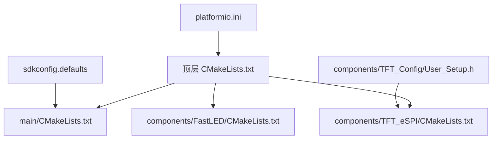
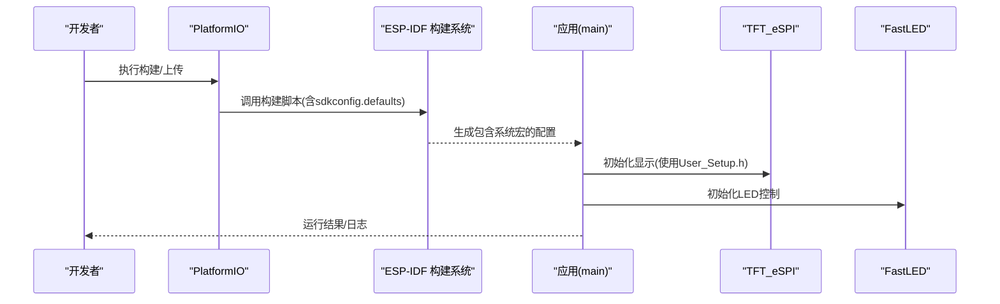
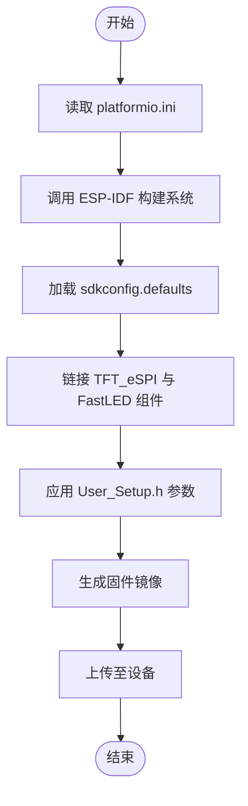
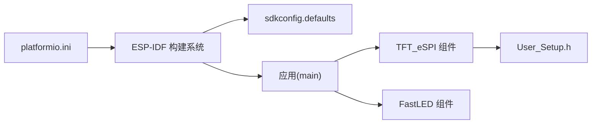

# 配置管理

<cite>
**本文引用的文件**   
- [sdkconfig.defaults](file://sdkconfig.defaults)
- [User_Setup.h](file://components/TFT_Config/User_Setup.h)
- [platformio.ini](file://platformio.ini)
- [CMakeLists.txt](file://CMakeLists.txt)
- [main/CMakeLists.txt](file://main/CMakeLists.txt)
- [main/idf_component.yml](file://main/idf_component.yml)
- [components/FastLED/CMakeLists.txt](file://components/FastLED/CMakeLists.txt)
- [components/TFT_eSPI/CMakeLists.txt](file://components/TFT_eSPI/CMakeLists.txt)
</cite>

## 目录
1. [简介](#简介)
2. [项目结构](#项目结构)
3. [核心组件](#核心组件)
4. [架构总览](#架构总览)
5. [详细组件分析](#详细组件分析)
6. [依赖关系分析](#依赖关系分析)
7. [性能考虑](#性能考虑)
8. [故障排除指南](#故障排除指南)
9. [结论](#结论)
10. [附录](#附录)

## 简介
本文件面向ESP32中心节点的配置管理系统，聚焦三类关键配置文件：
- ESP-IDF系统级配置（sdkconfig.defaults）：WiFi、蓝牙、调试输出等
- TFT显示驱动硬件参数（components/TFT_Config/User_Setup.h）：引脚、尺寸、颜色深度等
- PlatformIO开发环境（platformio.ini）：工具链、调试器、上传端口等

文档提供最佳实践、常见模板、验证方法与故障排除，并给出跨平台迁移建议。

## 项目结构
本项目采用分层与模块化组织方式：
- 顶层构建与平台配置：CMakeLists.txt、platformio.ini
- ESP-IDF默认配置：sdkconfig.defaults
- 组件层：TFT_eSPI与FastLED作为子组件，通过各自CMakeLists.txt集成
- 应用入口：main/ 下的CMakeLists.txt与idf_component.yml定义应用组件与依赖
- 用户自定义TFT参数：components/TFT_Config/User_Setup.h

图表来源
- [CMakeLists.txt:1-200](file://CMakeLists.txt#L1-L200)
- [main/CMakeLists.txt:1-200](file://main/CMakeLists.txt#L1-L200)
- [components/TFT_eSPI/CMakeLists.txt:1-200](file://components/TFT_eSPI/CMakeLists.txt#L1-L200)
- [components/FastLED/CMakeLists.txt:1-200](file://components/FastLED/CMakeLists.txt#L1-L200)
- [sdkconfig.defaults:1-200](file://sdkconfig.defaults#L1-L200)
- [components/TFT_Config/User_Setup.h:1-200](file://components/TFT_Config/User_Setup.h#L1-L200)
- [platformio.ini:1-200](file://platformio.ini#L1-L200)

章节来源
- [CMakeLists.txt:1-200](file://CMakeLists.txt#L1-L200)
- [main/CMakeLists.txt:1-200](file://main/CMakeLists.txt#L1-L200)
- [components/TFT_eSPI/CMakeLists.txt:1-200](file://components/TFT_eSPI/CMakeLists.txt#L1-L200)
- [components/FastLED/CMakeLists.txt:1-200](file://components/FastLED/CMakeLists.txt#L1-L200)
- [sdkconfig.defaults:1-200](file://sdkconfig.defaults#L1-L200)
- [components/TFT_Config/User_Setup.h:1-200](file://components/TFT_Config/User_Setup.h#L1-L200)
- [platformio.ini:1-200](file://platformio.ini#L1-L200)

## 核心组件
本节概述三大配置域的职责与交互：
- ESP-IDF系统配置（sdkconfig.defaults）：集中管理WiFi、蓝牙、日志级别、分区表、文件系统、电源管理等系统选项，影响编译期宏与运行时行为
- TFT硬件参数（User_Setup.h）：为TFT_eSPI库提供屏幕型号、引脚映射、颜色深度、旋转、触摸等参数，直接影响显示初始化与驱动选择
- PlatformIO环境（platformio.ini）：指定目标板、工具链、调试器、串口、上传协议、构建选项等，决定本地开发与烧录流程

章节来源
- [sdkconfig.defaults:1-200](file://sdkconfig.defaults#L1-L200)
- [components/TFT_Config/User_Setup.h:1-200](file://components/TFT_Config/User_Setup.h#L1-L200)
- [platformio.ini:1-200](file://platformio.ini#L1-L200)

## 架构总览
下图展示配置在构建与运行期的作用路径：PlatformIO触发构建，读取sdkconfig.defaults生成最终配置；应用链接TFT_eSPI与FastLED组件；TFT_eSPI根据User_Setup.h初始化显示。

图表来源
- [platformio.ini:1-200](file://platformio.ini#L1-L200)
- [sdkconfig.defaults:1-200](file://sdkconfig.defaults#L1-L200)
- [components/TFT_Config/User_Setup.h:1-200](file://components/TFT_Config/User_Setup.h#L1-L200)
- [components/TFT_eSPI/CMakeLists.txt:1-200](file://components/TFT_eSPI/CMakeLists.txt#L1-L200)
- [components/FastLED/CMakeLists.txt:1-200](file://components/FastLED/CMakeLists.txt#L1-L200)

## 详细组件分析

### ESP-IDF系统配置（sdkconfig.defaults）
- 作用范围
  - 控制WiFi栈、蓝牙栈、日志输出级别、分区表、文件系统、电源管理、安全启动等
  - 影响编译期宏定义与运行时子系统能力
- 典型配置项类别
  - WiFi：启用/禁用、最大连接数、事件回调、功耗模式
  - 蓝牙：BLE/经典蓝牙开关、堆大小、扫描策略
  - 调试输出：UART控制台、日志级别、时间戳
  - 存储：SPIFFS/LittleFS、NVS分区、Flash频率
  - 电源：空闲模式、CPU频率、唤醒源
- 最佳实践
  - 将默认值放入sdkconfig.defaults，针对特定板卡或场景通过覆盖文件调整
  - 避免硬编码敏感信息（如Wi-Fi密码），使用运行时配置或OTA下发
  - 合理设置日志级别，生产环境降低冗余输出以提升吞吐
- 验证方法
  - 构建后检查生成的sdkconfig文件是否包含预期宏
  - 运行期打印系统信息与子系统状态，确认功能可用
- 常见问题
  - 内存不足：适当缩小蓝牙/WiFi堆或关闭未用模块
  - 启动慢：减少不必要的服务与高日志级别
  - 分区冲突：核对分区表与文件系统大小

章节来源
- [sdkconfig.defaults:1-200](file://sdkconfig.defaults#L1-L200)

### TFT显示屏硬件参数（components/TFT_Config/User_Setup.h）
- 作用范围
  - 为TFT_eSPI提供屏幕型号、引脚映射、颜色深度、旋转方向、触摸控制器等
- 关键参数维度
  - 屏幕型号与驱动IC：选择匹配的驱动头
  - 引脚定义：SPI/MCU接口引脚（CS、DC、RST、MOSI、SCK、MISO）、背光控制
  - 显示参数：分辨率、颜色深度、偏移、旋转
  - 触摸：控制器类型与引脚
- 最佳实践
  - 不同屏型维护独立User_Setup文件，通过构建选项切换
  - 引脚分配遵循ESP32引脚约束（避免ADC冲突、JTAG冲突）
  - 颜色深度与刷新率权衡，兼顾流畅度与带宽
- 验证方法
  - 上电后自检绘制测试图案，检查行列与颜色正确性
  - 触摸校准与多点触控测试
- 常见问题
  - 花屏/错位：检查引脚与驱动匹配、时序参数
  - 触摸无响应：确认触摸控制器与中断引脚
  - 亮度异常：背光引脚与占空比设置

章节来源
- [components/TFT_Config/User_Setup.h:1-200](file://components/TFT_Config/User_Setup.h#L1-L200)

### PlatformIO开发环境（platformio.ini）
- 作用范围
  - 指定目标板、工具链、调试器、串口、上传协议、构建选项、环境变量
- 关键配置项
  - 平台与板卡：esp32系列具体型号
  - 工具链：esptool、openocd、gdbserver等
  - 调试：OpenOCD/ESP-PROG/JTAG参数
  - 上传：波特率、端口、协议（uart/ota）
  - 构建：优化等级、警告、预定义宏
- 最佳实践
  - 按环境拆分配置段（开发、测试、发布）
  - 使用变量与include复用通用设置
  - 明确区分调试与发布构建的日志与优化级别
- 验证方法
  - 执行clean/build/upload流水线，确认无报错
  - 使用monitor查看串口输出，验证通信与日志
- 常见问题
  - 上传失败：检查端口权限、USB线、复位电路
  - 调试无法连接：确认JTAG连线与OpenOCD配置
  - 构建失败：清理缓存、更新工具链

章节来源
- [platformio.ini:1-200](file://platformio.ini#L1-L200)

### 组件集成与CMake配置
- components/TFT_eSPI与components/FastLED通过各自CMakeLists.txt注册为组件，供应用链接
- main/CMakeLists.txt与main/idf_component.yml定义应用组件名、依赖与版本约束
- 顶层CMakeLists.txt协调各组件与应用构建

图表来源
- [platformio.ini:1-200](file://platformio.ini#L1-L200)
- [CMakeLists.txt:1-200](file://CMakeLists.txt#L1-L200)
- [main/CMakeLists.txt:1-200](file://main/CMakeLists.txt#L1-L200)
- [main/idf_component.yml:1-200](file://main/idf_component.yml#L1-L200)
- [components/TFT_eSPI/CMakeLists.txt:1-200](file://components/TFT_eSPI/CMakeLists.txt#L1-L200)
- [components/FastLED/CMakeLists.txt:1-200](file://components/FastLED/CMakeLists.txt#L1-L200)
- [components/TFT_Config/User_Setup.h:1-200](file://components/TFT_Config/User_Setup.h#L1-L200)

章节来源
- [CMakeLists.txt:1-200](file://CMakeLists.txt#L1-L200)
- [main/CMakeLists.txt:1-200](file://main/CMakeLists.txt#L1-L200)
- [main/idf_component.yml:1-200](file://main/idf_component.yml#L1-L200)
- [components/TFT_eSPI/CMakeLists.txt:1-200](file://components/TFT_eSPI/CMakeLists.txt#L1-L200)
- [components/FastLED/CMakeLists.txt:1-200](file://components/FastLED/CMakeLists.txt#L1-L200)

## 依赖关系分析
- 构建期依赖
  - platformio.ini 驱动 ESP-IDF 构建流程
  - sdkconfig.defaults 提供系统级宏与特性开关
  - main/idf_component.yml 声明应用组件与外部组件依赖
- 运行时依赖
  - 应用初始化顺序：系统配置生效 → 外设（WiFi/蓝牙/串口）→ 显示（TFT_eSPI）→ 其他外设（FastLED）
- 潜在耦合点
  - 引脚冲突：TFT与FastLED共享GPIO时需避免冲突
  - 资源竞争：高吞吐显示与网络并发需平衡内存与时钟

图表来源
- [platformio.ini:1-200](file://platformio.ini#L1-L200)
- [sdkconfig.defaults:1-200](file://sdkconfig.defaults#L1-L200)
- [components/TFT_eSPI/CMakeLists.txt:1-200](file://components/TFT_eSPI/CMakeLists.txt#L1-L200)
- [components/FastLED/CMakeLists.txt:1-200](file://components/FastLED/CMakeLists.txt#L1-L200)
- [components/TFT_Config/User_Setup.h:1-200](file://components/TFT_Config/User_Setup.h#L1-L200)

章节来源
- [platformio.ini:1-200](file://platformio.ini#L1-L200)
- [sdkconfig.defaults:1-200](file://sdkconfig.defaults#L1-L200)
- [components/TFT_eSPI/CMakeLists.txt:1-200](file://components/TFT_eSPI/CMakeLists.txt#L1-L200)
- [components/FastLED/CMakeLists.txt:1-200](file://components/FastLED/CMakeLists.txt#L1-L200)
- [components/TFT_Config/User_Setup.h:1-200](file://components/TFT_Config/User_Setup.h#L1-L200)

## 性能考虑
- 日志级别：生产环境降低日志以减少CPU占用与总线开销
- 显示刷新：合理设置颜色深度与DMA传输，避免阻塞主循环
- 网络与蓝牙：按需开启，限制扫描与连接数量，避免抢占CPU
- 电源管理：启用合适的空闲模式与CPU频率，平衡功耗与实时性

[本节为通用指导，不直接分析具体文件]

## 故障排除指南
- 构建阶段
  - 现象：编译失败或找不到组件
  - 排查：检查CMakeLists与idf_component.yml依赖声明；清理构建缓存；确认sdkconfig.defaults中相关宏已启用
- 上传阶段
  - 现象：无法连接或上传失败
  - 排查：确认platformio.ini中的端口与协议；检查USB线与供电；尝试按住BOOT键再复位
- 运行阶段
  - 现象：无显示或显示异常
  - 排查：核对User_Setup.h引脚与驱动匹配；检查SPI时钟与电平；单独运行显示自检例程
  - 现象：WiFi/蓝牙不可用
  - 排查：确认sdkconfig.defaults中对应模块已启用；检查天线与射频配置；查看日志定位错误码
- 调试阶段
  - 现象：OpenOCD/GDB无法连接
  - 排查：检查JTAG连线与上拉电阻；确认OpenOCD目标芯片与速度；验证电源稳定

章节来源
- [platformio.ini:1-200](file://platformio.ini#L1-L200)
- [sdkconfig.defaults:1-200](file://sdkconfig.defaults#L1-L200)
- [components/TFT_Config/User_Setup.h:1-200](file://components/TFT_Config/User_Setup.h#L1-L200)

## 结论
通过统一的管理策略，将ESP-IDF系统配置、TFT硬件参数与PlatformIO环境解耦，可显著提升可维护性与可移植性。建议在多硬件平台下建立配置矩阵与模板，结合自动化验证确保一致性。

[本节为总结性内容，不直接分析具体文件]

## 附录

### 常见配置模板（示例说明）
- 仅WiFi场景
  - 启用WiFi与STA模式，关闭蓝牙，降低日志级别
- 仅蓝牙场景
  - 启用BLE，限制广播间隔与连接数，关闭WiFi
- 全功能场景
  - 同时启用WiFi与BLE，提升堆大小，适度提高日志级别用于调试
- 低功耗场景
  - 启用空闲模式与动态降频，减少外设活动，关闭非必要服务

[本节为概念性模板说明，不直接分析具体文件]

### 配置验证清单
- 构建产物
  - 检查生成的sdkconfig是否包含预期宏
  - 确认组件链接成功，无缺失符号
- 运行自检
  - 串口输出系统信息与子系统状态
  - 显示绘制测试图，触摸进行多点校验
  - WiFi/BLE连通性测试
- 压力测试
  - 长时间运行观察内存与任务栈使用
  - 高负载下刷新显示与网络收发稳定性

[本节为通用验证方法，不直接分析具体文件]

### 跨平台迁移指导
- 从Arduino迁移到ESP-IDF
  - 将Arduino库替换为ESP-IDF组件（如TFT_eSPI、FastLED）
  - 使用sdkconfig.defaults替代Arduino的platform.txt或board.json
  - 在main/idf_component.yml中声明组件依赖
- 从ESP32-S2/S3迁移到ESP32-C3
  - 调整引脚映射与外设可用性（如SPI/I2C/ADC）
  - 更新User_Setup.h与系统配置以适配新芯片特性
- 从PlatformIO迁移到ESP-IDF CLI
  - 将platformio.ini转换为CMake与KConfig配置
  - 使用idf.py进行构建与上传，保持sdkconfig.defaults一致

[本节为概念性迁移指导，不直接分析具体文件]