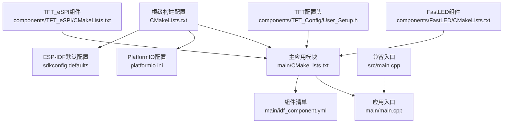
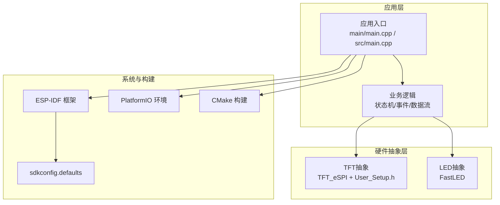
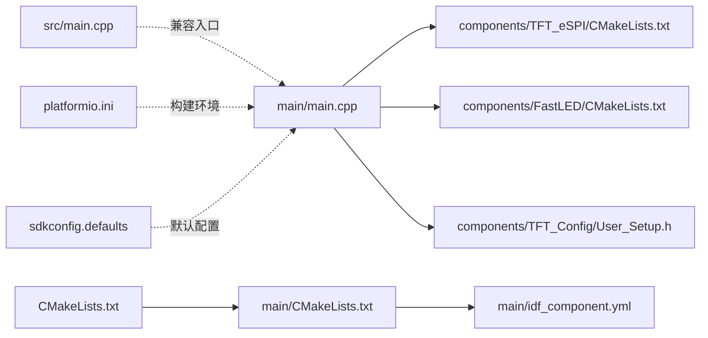

# 项目概述

<cite>
**本文引用的文件**   
- [CMakeLists.txt](file://CMakeLists.txt)
- [platformio.ini](file://platformio.ini)
- [sdkconfig.defaults](file://sdkconfig.defaults)
- [main/CMakeLists.txt](file://main/CMakeLists.txt)
- [main/idf_component.yml](file://main/idf_component.yml)
- [main/main.cpp](file://main/main.cpp)
- [src/main.cpp](file://src/main.cpp)
- [components/FastLED/CMakeLists.txt](file://components/FastLED/CMakeLists.txt)
- [components/TFT_Config/User_Setup.h](file://components/TFT_Config/User_Setup.h)
- [components/TFT_eSPI/CMakeLists.txt](file://components/TFT_eSPI/CMakeLists.txt)
</cite>

## 目录
1. [简介](#简介)
2. [项目结构](#项目结构)
3. [核心组件](#核心组件)
4. [架构总览](#架构总览)
5. [详细组件分析](#详细组件分析)
6. [依赖关系分析](#依赖关系分析)
7. [性能与资源考量](#性能与资源考量)
8. [故障排查指南](#故障排查指南)
9. [结论](#结论)
10. [附录](#附录)

## 简介
本项目是一个基于ESP32微控制器的物联网中心节点应用，面向“设备汇聚+本地交互”的场景。其目标是在单板上同时驱动TFT显示屏与FastLED灯带，提供本地可视化状态、用户交互入口以及对外通信的集中能力。项目采用模块化设计，将硬件抽象层（HAL）与业务逻辑解耦，便于在不同硬件配置下复用；同时支持ESP-IDF与PlatformIO两种开发环境，具备跨平台构建能力。

典型使用场景示例：
- 智能家居中控面板：显示各子设备状态，通过屏幕交互切换模式，并以LED条作为氛围指示。
- 工业边缘网关：聚合传感器数据，在本地屏显关键指标，以LED颜色表达告警等级。
- 创客原型平台：快速验证UI/UX与外设组合，迭代产品形态。

## 项目结构
仓库采用分层与特性并行的组织方式：顶层为构建与环境配置，main为应用入口与组件清单，src用于兼容或备用入口，components存放第三方库与自定义组件，include预留公共头文件位置。

图表来源
- [CMakeLists.txt](file://CMakeLists.txt)
- [main/CMakeLists.txt](file://main/CMakeLists.txt)
- [platformio.ini](file://platformio.ini)
- [sdkconfig.defaults](file://sdkconfig.defaults)
- [main/main.cpp](file://main/main.cpp)
- [src/main.cpp](file://src/main.cpp)
- [components/FastLED/CMakeLists.txt](file://components/FastLED/CMakeLists.txt)
- [components/TFT_Config/User_Setup.h](file://components/TFT_Config/User_Setup.h)
- [components/TFT_eSPI/CMakeLists.txt](file://components/TFT_eSPI/CMakeLists.txt)

章节来源
- [CMakeLists.txt](file://CMakeLists.txt)
- [platformio.ini](file://platformio.ini)
- [sdkconfig.defaults](file://sdkconfig.defaults)
- [main/CMakeLists.txt](file://main/CMakeLists.txt)
- [main/idf_component.yml](file://main/idf_component.yml)
- [main/main.cpp](file://main/main.cpp)
- [src/main.cpp](file://src/main.cpp)
- [components/FastLED/CMakeLists.txt](file://components/FastLED/CMakeLists.txt)
- [components/TFT_Config/User_Setup.h](file://components/TFT_Config/User_Setup.h)
- [components/TFT_eSPI/CMakeLists.txt](file://components/TFT_eSPI/CMakeLists.txt)

## 核心组件
- 应用入口与任务编排
  - ESP-IDF路径：main/main.cpp作为启动点，负责初始化系统、注册任务与事件循环、挂载外设与UI。
  - PlatformIO兼容路径：src/main.cpp提供等效入口，便于在PIO环境下直接编译运行。
- 显示子系统（TFT）
  - 通过TFT_eSPI组件接入，User_Setup.h用于引脚、时序与分辨率等参数化配置，实现跨屏型适配。
- 灯光子系统（FastLED）
  - 通过FastLED组件管理LED灯带，提供像素级渲染与动画效果，常用于状态指示与氛围展示。
- 构建与依赖
  - 顶层CMakeLists.txt协调模块与组件；main/CMakeLists.txt声明应用模块；idf_component.yml列出ESP-IDF组件依赖；platformio.ini定义PIO工程环境与工具链；sdkconfig.defaults提供ESP-IDF默认配置项。

章节来源
- [main/main.cpp](file://main/main.cpp)
- [src/main.cpp](file://src/main.cpp)
- [components/TFT_Config/User_Setup.h](file://components/TFT_Config/User_Setup.h)
- [components/TFT_eSPI/CMakeLists.txt](file://components/TFT_eSPI/CMakeLists.txt)
- [components/FastLED/CMakeLists.txt](file://components/FastLED/CMakeLists.txt)
- [main/CMakeLists.txt](file://main/CMakeLists.txt)
- [main/idf_component.yml](file://main/idf_component.yml)
- [CMakeLists.txt](file://CMakeLists.txt)
- [platformio.ini](file://platformio.ini)
- [sdkconfig.defaults](file://sdkconfig.defaults)

## 架构总览
系统采用“硬件抽象层 + 业务逻辑层 + 应用入口”的分层架构。硬件抽象层封装TFT与FastLED的具体驱动细节，业务逻辑层处理状态机、事件分发与数据流转，应用入口负责生命周期管理与任务调度。该设计使不同屏幕/灯带型号可插拔替换，且便于在ESP-IDF与PlatformIO之间迁移。

图表来源
- [main/main.cpp](file://main/main.cpp)
- [src/main.cpp](file://src/main.cpp)
- [components/TFT_Config/User_Setup.h](file://components/TFT_Config/User_Setup.h)
- [components/TFT_eSPI/CMakeLists.txt](file://components/TFT_eSPI/CMakeLists.txt)
- [components/FastLED/CMakeLists.txt](file://components/FastLED/CMakeLists.txt)
- [CMakeLists.txt](file://CMakeLists.txt)
- [platformio.ini](file://platformio.ini)
- [sdkconfig.defaults](file://sdkconfig.defaults)

## 详细组件分析

### 应用入口与任务编排
- 职责
  - 初始化系统时钟、日志、网络栈（如启用）、外设与UI。
  - 创建任务：显示刷新、LED更新、业务处理、I/O监听等。
  - 注册事件总线或队列，解耦UI与业务。
- 关键点
  - 在ESP-IDF中通过组件清单引入TFT与FastLED；在PIO中通过platformio.ini指定库与构建选项。
  - 通过配置开关选择不同屏幕/灯带型号，避免硬编码。
- 建议
  - 将UI绘制与LED更新放入独立任务，降低阻塞风险。
  - 使用环形缓冲或消息队列传递帧数据与像素更新。

章节来源
- [main/main.cpp](file://main/main.cpp)
- [src/main.cpp](file://src/main.cpp)
- [main/idf_component.yml](file://main/idf_component.yml)
- [platformio.ini](file://platformio.ini)

### 显示子系统（TFT）
- 职责
  - 提供统一的绘图接口（清屏、画线、文本、位图），屏蔽具体控制器差异。
  - 根据User_Setup.h中的引脚与时序参数适配不同屏幕。
- 关键点
  - 通过TFT_eSPI组件获得高性能绘制能力；User_Setup.h集中管理硬件相关常量。
  - 建议在业务层仅调用抽象接口，不直接触碰底层寄存器。
- 建议
  - 对频繁更新的区域使用局部刷新以减少带宽占用。
  - 将字体与图片资源置于外部存储或压缩格式，节省SRAM。

章节来源
- [components/TFT_Config/User_Setup.h](file://components/TFT_Config/User_Setup.h)
- [components/TFT_eSPI/CMakeLists.txt](file://components/TFT_eSPI/CMakeLists.txt)

### 灯光子系统（FastLED）
- 职责
  - 管理LED灯带的像素映射、色彩空间转换与动画序列。
  - 提供统一的状态色板与亮度控制，保证视觉一致性。
- 关键点
  - FastLED组件负责DMA/中断驱动的像素更新，避免阻塞主循环。
  - 通过配置对象绑定引脚、速率与芯片类型。
- 建议
  - 限制最大刷新率与亮度上限，平衡功耗与体验。
  - 将复杂动画拆分为多帧增量更新，降低峰值内存。

章节来源
- [components/FastLED/CMakeLists.txt](file://components/FastLED/CMakeLists.txt)

### 构建与依赖管理
- ESP-IDF
  - 顶层CMakeLists.txt汇总模块与组件；main/CMakeLists.txt声明应用模块；idf_component.yml列出组件依赖；sdkconfig.defaults提供默认配置。
- PlatformIO
  - platformio.ini定义目标板、工具链、库与构建脚本，便于在Windows/Linux/macOS上快速构建。
- 交叉构建
  - 通过条件编译与配置宏，在同一份源码下切换ESP-IDF与PIO构建流程。

章节来源
- [CMakeLists.txt](file://CMakeLists.txt)
- [main/CMakeLists.txt](file://main/CMakeLists.txt)
- [main/idf_component.yml](file://main/idf_component.yml)
- [platformio.ini](file://platformio.ini)
- [sdkconfig.defaults](file://sdkconfig.defaults)

## 依赖关系分析
下图展示了主要源文件与组件之间的依赖关系，体现“入口 -> 业务 -> 硬件抽象 -> 组件”的单向依赖。

图表来源
- [main/main.cpp](file://main/main.cpp)
- [src/main.cpp](file://src/main.cpp)
- [components/TFT_eSPI/CMakeLists.txt](file://components/TFT_eSPI/CMakeLists.txt)
- [components/FastLED/CMakeLists.txt](file://components/FastLED/CMakeLists.txt)
- [components/TFT_Config/User_Setup.h](file://components/TFT_Config/User_Setup.h)
- [CMakeLists.txt](file://CMakeLists.txt)
- [main/CMakeLists.txt](file://main/CMakeLists.txt)
- [main/idf_component.yml](file://main/idf_component.yml)
- [platformio.ini](file://platformio.ini)
- [sdkconfig.defaults](file://sdkconfig.defaults)

## 性能与资源考量
- 显示刷新
  - 优先使用局部刷新与双缓冲策略，减少SPI/并行总线压力。
  - 合理设置字体大小与颜色深度，避免大对象频繁分配。
- LED更新
  - 控制帧率与亮度，避免瞬时电流过大导致复位。
  - 将动画分解为增量更新，降低峰值内存占用。
- 任务与中断
  - 将耗时操作放入低优先级任务，避免抢占高实时性任务。
  - 使用队列/信号量进行线程间同步，避免竞态条件。
- 电源与热管理
  - 动态调节屏幕背光与LED亮度，结合温度或电池电量自适应。

[本节为通用指导，无需代码来源]

## 故障排查指南
- 无法进入应用
  - 检查ESP-IDF默认配置是否覆盖必要项；确认PIO目标板与工具链版本匹配。
- 屏幕无显示或花屏
  - 核对User_Setup.h中的引脚与时序参数；检查排线与供电稳定性。
- LED异常或不亮
  - 确认引脚、速率与芯片类型配置；测量供电能力与信号完整性。
- 构建失败
  - ESP-IDF：清理构建缓存后重试；检查idf_component.yml依赖版本。
  - PlatformIO：清理平台缓存并重新下载依赖；确认编译器与SDK版本。

章节来源
- [sdkconfig.defaults](file://sdkconfig.defaults)
- [platformio.ini](file://platformio.ini)
- [components/TFT_Config/User_Setup.h](file://components/TFT_Config/User_Setup.h)
- [main/idf_component.yml](file://main/idf_component.yml)

## 结论
本项目以清晰的模块化与分层架构，将TFT显示与FastLED灯带集成到ESP32中心节点应用中，既满足初学者快速上手的需求，也为有经验的开发者提供了可扩展的技术基础。借助ESP-IDF与PlatformIO双环境支持与跨平台构建能力，项目可在多种硬件平台上复用，适合智能家居、工业边缘与创客原型等多类场景。

[本节为总结性内容，无需代码来源]

## 附录
- 术语说明
  - 硬件抽象层（HAL）：屏蔽具体外设差异的统一接口层。
  - 组件：可复用的功能模块，通常包含源码、头文件与构建脚本。
  - 任务：RTOS中的执行单元，用于并发处理不同职责。
- 快速开始
  - ESP-IDF：配置默认项后，按标准流程编译与烧录。
  - PlatformIO：安装插件后，选择目标板一键构建与上传。

[本节为补充信息，无需代码来源]