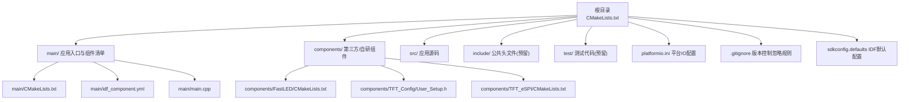
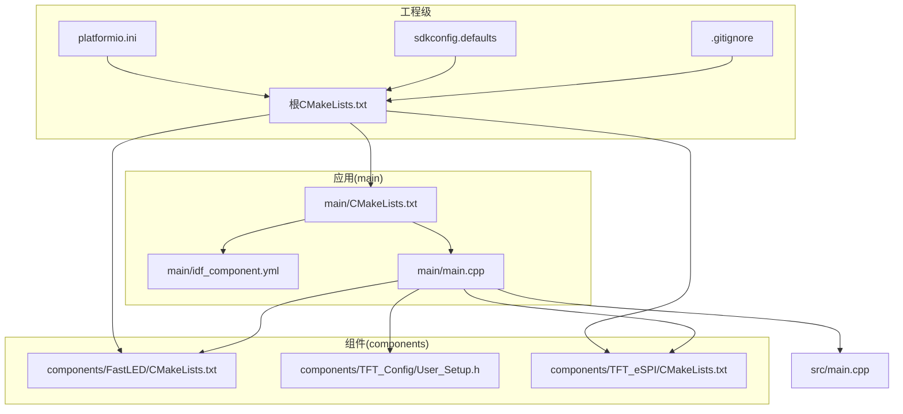
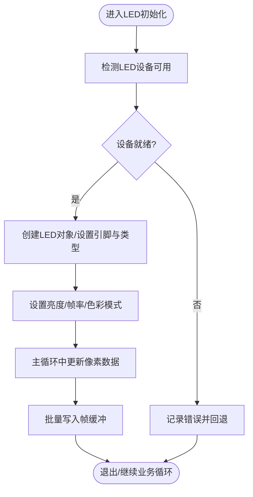
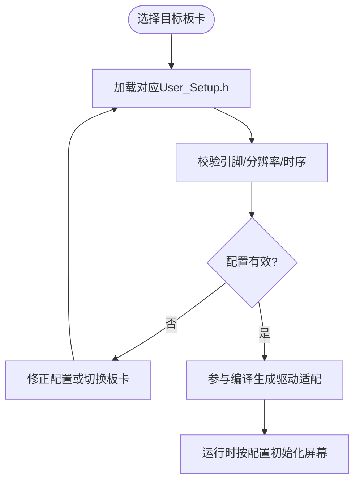
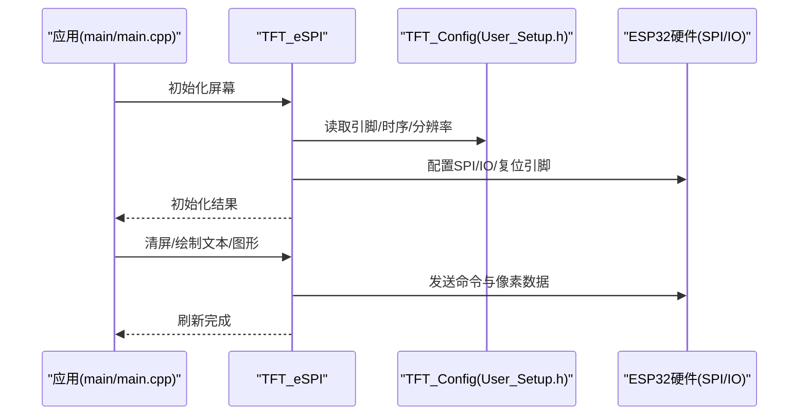
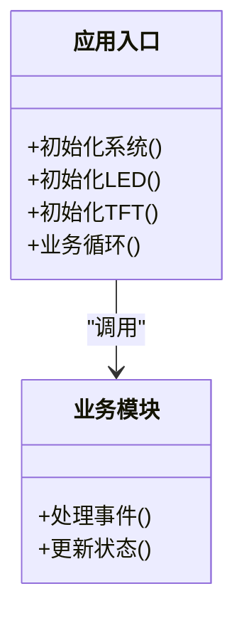
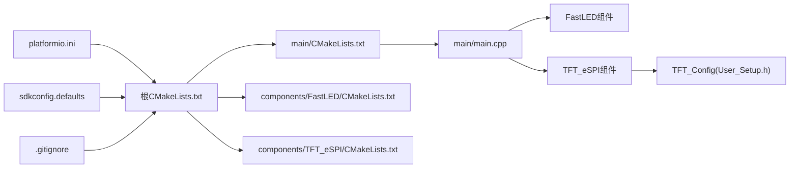

# 项目结构

<cite>
**本文引用的文件**   
- [CMakeLists.txt](file://CMakeLists.txt)
- [platformio.ini](file://platformio.ini)
- [.gitignore](file://.gitignore)
- [sdkconfig.defaults](file://sdkconfig.defaults)
- [main/CMakeLists.txt](file://main/CMakeLists.txt)
- [main/idf_component.yml](file://main/idf_component.yml)
- [main/main.cpp](file://main/main.cpp)
- [src/main.cpp](file://src/main.cpp)
- [components/FastLED/CMakeLists.txt](file://components/FastLED/CMakeLists.txt)
- [components/TFT_Config/User_Setup.h](file://components/TFT_Config/User_Setup.h)
- [components/TFT_eSPI/CMakeLists.txt](file://components/TFT_eSPI/CMakeLists.txt)
</cite>

## 目录
1. [简介](#简介)
2. [项目结构](#项目结构)
3. [核心组件](#核心组件)
4. [架构总览](#架构总览)
5. [详细组件分析](#详细组件分析)
6. [依赖关系分析](#依赖关系分析)
7. [性能与构建注意事项](#性能与构建注意事项)
8. [故障排查指南](#故障排查指南)
9. [结论](#结论)
10. [附录：新成员导航指南](#附录新成员导航指南)

## 简介
本文件面向ESP32中心节点项目的开发者与维护者，系统化说明项目的目录结构与组织方式，重点解释 components 下的三个关键组件（FastLED LED控制库、TFT_Config显示配置、TFT_eSPI显示驱动），以及 main 作为主应用程序入口的职责、src 的源代码组织方式。同时梳理配置文件的作用与ESP-IDF标准目录结构的约定，帮助新加入项目的开发者快速上手。

## 项目结构
项目采用“应用+组件”的分层组织方式：顶层为工程级构建与平台配置；main 为应用主程序与组件元数据；components 存放第三方或自研组件；src 用于存放可被应用直接编译的源文件；include 预留公共头文件空间；test 用于测试代码。

图表来源
- [CMakeLists.txt:1-200](file://CMakeLists.txt#L1-L200)
- [main/CMakeLists.txt:1-200](file://main/CMakeLists.txt#L1-L200)
- [main/idf_component.yml:1-200](file://main/idf_component.yml#L1-L200)
- [main/main.cpp:1-200](file://main/main.cpp#L1-L200)
- [src/main.cpp:1-200](file://src/main.cpp#L1-L200)
- [components/FastLED/CMakeLists.txt:1-200](file://components/FastLED/CMakeLists.txt#L1-L200)
- [components/TFT_Config/User_Setup.h:1-200](file://components/TFT_Config/User_Setup.h#L1-L200)
- [components/TFT_eSPI/CMakeLists.txt:1-200](file://components/TFT_eSPI/CMakeLists.txt#L1-L200)
- [platformio.ini:1-200](file://platformio.ini#L1-L200)
- [.gitignore:1-200](file://.gitignore#L1-L200)
- [sdkconfig.defaults:1-200](file://sdkconfig.defaults#L1-L200)

章节来源
- [CMakeLists.txt:1-200](file://CMakeLists.txt#L1-L200)
- [platformio.ini:1-200](file://platformio.ini#L1-L200)
- [.gitignore:1-200](file://.gitignore#L1-L200)
- [sdkconfig.defaults:1-200](file://sdkconfig.defaults#L1-L200)
- [main/CMakeLists.txt:1-200](file://main/CMakeLists.txt#L1-L200)
- [main/idf_component.yml:1-200](file://main/idf_component.yml#L1-L200)
- [main/main.cpp:1-200](file://main/main.cpp#L1-L200)
- [src/main.cpp:1-200](file://src/main.cpp#L1-L200)
- [components/FastLED/CMakeLists.txt:1-200](file://components/FastLED/CMakeLists.txt#L1-L200)
- [components/TFT_Config/User_Setup.h:1-200](file://components/TFT_Config/User_Setup.h#L1-L200)
- [components/TFT_eSPI/CMakeLists.txt:1-200](file://components/TFT_eSPI/CMakeLists.txt#L1-L200)

## 核心组件
- FastLED（LED控制）
  - 作用：提供WS2812等可编程LED灯带的驱动与效果算法，常用于状态指示、氛围灯效等。
  - 集成点：通过 components/FastLED/CMakeLists.txt 暴露给上层构建系统，供应用链接与调用。
  - 典型用法：在应用初始化阶段创建LED对象、设置亮度与帧率、在主循环中更新像素数据。
  - 参考路径：[components/FastLED/CMakeLists.txt](file://components/FastLED/CMakeLists.txt)

- TFT_Config（显示配置）
  - 作用：集中管理TFT屏幕相关参数（如引脚映射、分辨率、颜色深度、时序等），便于在不同硬件上复用同一套显示逻辑。
  - 集成点：User_Setup.h 通常被 TFT_eSPI 包含以覆盖默认配置。
  - 典型用法：根据实际板卡修改引脚定义与屏幕型号，确保与硬件一致。
  - 参考路径：[components/TFT_Config/User_Setup.h](file://components/TFT_Config/User_Setup.h)

- TFT_eSPI（显示驱动）
  - 作用：跨MCU的TFT/LCD驱动库，封装底层SPI/并行接口与屏幕控制器细节，向上提供统一的绘图API。
  - 集成点：通过 components/TFT_eSPI/CMakeLists.txt 注册到构建系统，并在应用中初始化与绘制UI。
  - 典型用法：初始化屏幕、清屏、绘制文本/图形、刷新缓冲区。
  - 参考路径：[components/TFT_eSPI/CMakeLists.txt](file://components/TFT_eSPI/CMakeLists.txt)

章节来源
- [components/FastLED/CMakeLists.txt:1-200](file://components/FastLED/CMakeLists.txt#L1-L200)
- [components/TFT_Config/User_Setup.h:1-200](file://components/TFT_Config/User_Setup.h#L1-L200)
- [components/TFT_eSPI/CMakeLists.txt:1-200](file://components/TFT_eSPI/CMakeLists.txt#L1-L200)

## 架构总览
从构建与运行视角看，顶层CMake负责工程级配置与组件发现；main 子工程声明应用目标与依赖；components 中的各组件通过各自的CMakeLists暴露接口；应用入口 main/main.cpp 完成外设初始化（LED、TFT）、业务逻辑与事件循环；src 提供可复用的业务模块；platformio.ini 支持在PlatformIO环境下进行调试与上传；sdkconfig.defaults 提供ESP-IDF默认配置项。

图表来源
- [CMakeLists.txt:1-200](file://CMakeLists.txt#L1-L200)
- [main/CMakeLists.txt:1-200](file://main/CMakeLists.txt#L1-L200)
- [main/idf_component.yml:1-200](file://main/idf_component.yml#L1-L200)
- [main/main.cpp:1-200](file://main/main.cpp#L1-L200)
- [src/main.cpp:1-200](file://src/main.cpp#L1-L200)
- [components/FastLED/CMakeLists.txt:1-200](file://components/FastLED/CMakeLists.txt#L1-L200)
- [components/TFT_Config/User_Setup.h:1-200](file://components/TFT_Config/User_Setup.h#L1-L200)
- [components/TFT_eSPI/CMakeLists.txt:1-200](file://components/TFT_eSPI/CMakeLists.txt#L1-L200)
- [platformio.ini:1-200](file://platformio.ini#L1-L200)
- [.gitignore:1-200](file://.gitignore#L1-L200)
- [sdkconfig.defaults:1-200](file://sdkconfig.defaults#L1-L200)

## 详细组件分析

### 组件A：FastLED（LED控制）
- 职责边界
  - 对外暴露LED设备抽象与渲染API；内部封装底层DMA/SPI/PWM等驱动细节。
- 数据结构与复杂度
  - 常见为像素数组与帧缓冲，更新复杂度与像素数量线性相关；建议按需刷新与降低刷新频率以提升性能。
- 依赖链
  - 应用 -> FastLED -> ESP-IDF底层GPIO/DMA/SPI。
- 优化建议
  - 合理设置最大亮度与帧率；使用批处理更新；避免在主循环中进行阻塞操作。
- 错误处理
  - 初始化失败时返回错误码；断线或供电不足时降级显示策略。

图表来源
- [components/FastLED/CMakeLists.txt:1-200](file://components/FastLED/CMakeLists.txt#L1-L200)
- [main/main.cpp:1-200](file://main/main.cpp#L1-L200)

章节来源
- [components/FastLED/CMakeLists.txt:1-200](file://components/FastLED/CMakeLists.txt#L1-L200)
- [main/main.cpp:1-200](file://main/main.cpp#L1-L200)

### 组件B：TFT_Config（显示配置）
- 职责边界
  - 集中管理屏幕引脚、分辨率、颜色格式、时序参数等，屏蔽硬件差异。
- 数据结构与复杂度
  - 主要为常量与宏配置，无运行时复杂计算；变更影响编译期行为。
- 依赖链
  - TFT_eSPI 在编译期包含 User_Setup.h 以生成适配当前硬件的代码。
- 优化建议
  - 针对不同板卡维护多份配置；仅启用必要的功能以减少二进制体积。
- 错误处理
  - 配置不匹配会导致编译错误或运行时花屏；建议在CI中加入配置校验。

图表来源
- [components/TFT_Config/User_Setup.h:1-200](file://components/TFT_Config/User_Setup.h#L1-L200)
- [components/TFT_eSPI/CMakeLists.txt:1-200](file://components/TFT_eSPI/CMakeLists.txt#L1-L200)

章节来源
- [components/TFT_Config/User_Setup.h:1-200](file://components/TFT_Config/User_Setup.h#L1-L200)
- [components/TFT_eSPI/CMakeLists.txt:1-200](file://components/TFT_eSPI/CMakeLists.txt#L1-L200)

### 组件C：TFT_eSPI（显示驱动）
- 职责边界
  - 提供跨MCU的TFT驱动实现，封装SPI/并行总线与屏幕控制器命令集。
- 数据结构与复杂度
  - 内部维护帧缓冲与命令队列；绘制操作复杂度与绘制区域面积相关。
- 依赖链
  - 应用 -> TFT_eSPI -> ESP-IDF SPI/内存分配 -> TFT_Config（编译期）。
- 优化建议
  - 使用局部刷新与双缓冲；减少不必要的全屏重绘；合理设置SPI时钟。
- 错误处理
  - 初始化失败检查复位/片选/时钟引脚；通信异常时重试或降级。

图表来源
- [main/main.cpp:1-200](file://main/main.cpp#L1-L200)
- [components/TFT_eSPI/CMakeLists.txt:1-200](file://components/TFT_eSPI/CMakeLists.txt#L1-L200)
- [components/TFT_Config/User_Setup.h:1-200](file://components/TFT_Config/User_Setup.h#L1-L200)

章节来源
- [main/main.cpp:1-200](file://main/main.cpp#L1-L200)
- [components/TFT_eSPI/CMakeLists.txt:1-200](file://components/TFT_eSPI/CMakeLists.txt#L1-L200)
- [components/TFT_Config/User_Setup.h:1-200](file://components/TFT_Config/User_Setup.h#L1-L200)

### 应用入口与源码组织
- main/main.cpp
  - 角色：应用入口，负责系统初始化、组件初始化（LED、TFT）、业务逻辑与事件循环。
  - 建议：将长耗时任务拆分为非阻塞任务或FreeRTOS任务；统一错误上报与日志输出。
- src/main.cpp
  - 角色：存放可被应用直接编译的业务模块或工具函数，便于在多个目标间复用。
  - 建议：按功能域划分文件，保持单一职责；对外暴露稳定接口。

图表来源
- [main/main.cpp:1-200](file://main/main.cpp#L1-L200)
- [src/main.cpp:1-200](file://src/main.cpp#L1-L200)

章节来源
- [main/main.cpp:1-200](file://main/main.cpp#L1-L200)
- [src/main.cpp:1-200](file://src/main.cpp#L1-L200)

## 依赖关系分析
- 构建依赖
  - 根CMakeLists 聚合 main 与 components；main/CMakeLists 声明应用目标与依赖；components 各自通过CMakeLists暴露接口。
- 组件依赖
  - 应用依赖 FastLED 与 TFT_eSPI；TFT_eSPI 在编译期依赖 TFT_Config。
- 外部依赖
  - platformio.ini 用于PlatformIO环境；sdkconfig.defaults 提供ESP-IDF默认配置；.gitignore 排除构建产物与敏感信息。

图表来源
- [CMakeLists.txt:1-200](file://CMakeLists.txt#L1-L200)
- [main/CMakeLists.txt:1-200](file://main/CMakeLists.txt#L1-L200)
- [components/FastLED/CMakeLists.txt:1-200](file://components/FastLED/CMakeLists.txt#L1-L200)
- [components/TFT_eSPI/CMakeLists.txt:1-200](file://components/TFT_eSPI/CMakeLists.txt#L1-L200)
- [components/TFT_Config/User_Setup.h:1-200](file://components/TFT_Config/User_Setup.h#L1-L200)
- [platformio.ini:1-200](file://platformio.ini#L1-L200)
- [.gitignore:1-200](file://.gitignore#L1-L200)
- [sdkconfig.defaults:1-200](file://sdkconfig.defaults#L1-L200)

章节来源
- [CMakeLists.txt:1-200](file://CMakeLists.txt#L1-L200)
- [main/CMakeLists.txt:1-200](file://main/CMakeLists.txt#L1-L200)
- [components/FastLED/CMakeLists.txt:1-200](file://components/FastLED/CMakeLists.txt#L1-L200)
- [components/TFT_eSPI/CMakeLists.txt:1-200](file://components/TFT_eSPI/CMakeLists.txt#L1-L200)
- [components/TFT_Config/User_Setup.h:1-200](file://components/TFT_Config/User_Setup.h#L1-L200)
- [platformio.ini:1-200](file://platformio.ini#L1-L200)
- [.gitignore:1-200](file://.gitignore#L1-L200)
- [sdkconfig.defaults:1-200](file://sdkconfig.defaults#L1-L200)

## 性能与构建注意事项
- 构建系统
  - 根CMakeLists 负责工程级选项与组件发现；main/CMakeLists 定义应用目标、源文件与依赖；components 各自提供CMakeLists以便被识别与链接。
- 组件依赖管理
  - main/idf_component.yml 声明ESP-IDF组件依赖，便于自动拉取与版本锁定。
- 平台配置
  - sdkconfig.defaults 提供默认ESP-IDF配置项，可在不同目标间保持一致性。
- 开发体验
  - platformio.ini 支持PlatformIO的调试、上传与单元测试流程。
- 版本控制
  - .gitignore 排除构建产物、IDE缓存与敏感文件，保持仓库整洁与安全。

章节来源
- [CMakeLists.txt:1-200](file://CMakeLists.txt#L1-L200)
- [main/CMakeLists.txt:1-200](file://main/CMakeLists.txt#L1-L200)
- [main/idf_component.yml:1-200](file://main/idf_component.yml#L1-L200)
- [sdkconfig.defaults:1-200](file://sdkconfig.defaults#L1-L200)
- [platformio.ini:1-200](file://platformio.ini#L1-L200)
- [.gitignore:1-200](file://.gitignore#L1-L200)

## 故障排查指南
- 构建失败
  - 检查根CMakeLists与main/CMakeLists是否正确声明组件与应用目标；确认components下各组件CMakeLists存在且语法正确。
- 组件依赖缺失
  - 核对main/idf_component.yml是否包含所需ESP-IDF组件；必要时执行依赖更新。
- 屏幕显示异常
  - 检查TFT_Config/User_Setup.h的引脚与时序是否与硬件一致；确认TFT_eSPI已正确包含该配置。
- LED无响应
  - 检查FastLED初始化参数（引脚、类型、亮度）；确认供电与信号线连接可靠。
- 平台IO问题
  - 若使用PlatformIO，核对platformio.ini的板型、端口与上传器配置。

章节来源
- [CMakeLists.txt:1-200](file://CMakeLists.txt#L1-L200)
- [main/CMakeLists.txt:1-200](file://main/CMakeLists.txt#L1-L200)
- [main/idf_component.yml:1-200](file://main/idf_component.yml#L1-L200)
- [components/TFT_Config/User_Setup.h:1-200](file://components/TFT_Config/User_Setup.h#L1-L200)
- [components/TFT_eSPI/CMakeLists.txt:1-200](file://components/TFT_eSPI/CMakeLists.txt#L1-L200)
- [components/FastLED/CMakeLists.txt:1-200](file://components/FastLED/CMakeLists.txt#L1-L200)
- [platformio.ini:1-200](file://platformio.ini#L1-L200)

## 结论
本项目采用清晰的“应用+组件”分层结构，结合ESP-IDF的标准目录与命名约定，使LED与显示能力模块化、可复用、易维护。通过合理的CMake与idf_component.yml管理依赖，配合sdkconfig.defaults与platformio.ini提升构建与调试效率。.gitignore保障仓库整洁与安全。遵循本文档的组织规范与最佳实践，有助于团队高效协作与持续演进。

## 附录：新成员导航指南
- 快速上手
  - 阅读根CMakeLists了解工程级配置；查看main/CMakeLists与main/idf_component.yml掌握应用与依赖；定位main/main.cpp理解入口流程。
- 组件扩展
  - 新增组件时在components下新建目录并提供CMakeLists；在main/CMakeLists中引入；如需ESP-IDF组件，更新idf_component.yml。
- 显示与LED
  - 修改TFT_Config/User_Setup.h适配新屏幕；在应用初始化中调用TFT_eSPI与FastLED的初始化接口。
- 构建与调试
  - 使用ESP-IDF工具链或PlatformIO进行构建与调试；核对platformio.ini与sdkconfig.defaults。
- 版本控制
  - 遵守.gitignore规则，避免提交构建产物与敏感信息；提交前确保依赖与配置同步更新。